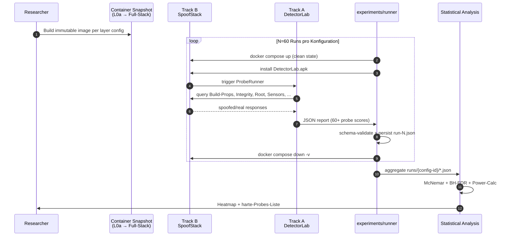
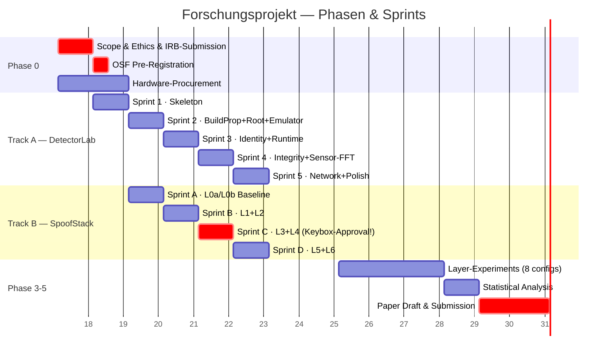
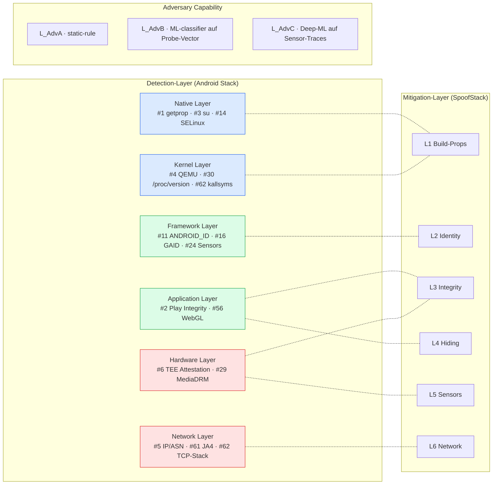
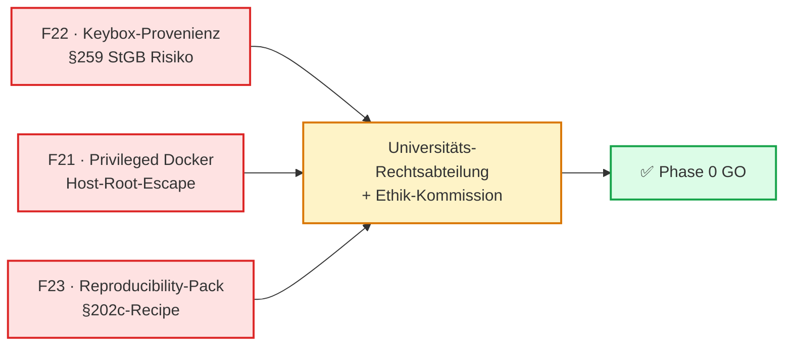

# Cloud Phone Research Planner

Akademisches Forschungsprojekt zur empirischen Evaluation der Erkennbarkeit virtualisierter Android-Umgebungen (ReDroid / MobileRun) gegenüber App-seitiger Detection.

> **Hochschulkontext** — Dieses Repository ist die Planungs- und Tracking-App für das Forschungsvorhaben.
> Es enthält **kein** Spoofing-Tooling und **keine** Anleitungen gegen Drittsysteme. Tests laufen ausschliesslich gegen die selbstentwickelte `DetectorLab`-Suite im isolierten Lab.

## Forschungsfrage

> Welche Android-Detection-Methoden (Build-Properties, Hardware-Attestation, Sensor-Signaturen, Netzwerk-Fingerprints) bleiben robust gegen Container-basierte Virtualisierung mit ARM-nativen Cloud-Phone-Stacks (ReDroid 12), und welche lassen sich layer-weise schliessen?

## Zwei Tracks

| Track | Rolle | Inhalt |
|---|---|---|
| **A — DetectorLab** | Red Team / Mess-Oracle | Eigene Android-App, die alle 60 Detection-Punkte standardisiert misst und JSON-Reports erzeugt. Open-Source-Beitrag. |
| **B — SpoofStack** | Blue Team / Subject Under Test | ReDroid-12-basierter Stack mit modular zuschaltbaren Mitigation-Layern (L0–L6). Wird **gegen DetectorLab** geprüft, nicht gegen Live-Plattformen. |

## System-Architektur

```mermaid
flowchart TB
    subgraph LAB["🔬 ISOLIERTES LABOR (eigenes VLAN, keine Live-Plattformen)"]
        direction TB

        subgraph TRACKB["🛡️ TRACK B — SpoofStack (Subject Under Test)"]
            direction TB
            L6["L6 · Network Egress<br/>Lab-LTE-Modem · Mobile-ASN"]
            L5["L5 · Sensor Emulation<br/>VirtualSensor + Trace-Player"]
            L4["L4 · Runtime Hiding<br/>Shamiko + HideMyAppList"]
            L3["L3 · Integrity & Attestation<br/>PIF + TrickyStore + Keybox"]
            L2["L2 · Identity Spoofing<br/>Android Faker"]
            L1["L1 · Build Properties<br/>DeviceSpoofLab Hooks/Magisk"]
            L0B["L0b · Root-Stack<br/>Magisk + ReZygisk + LSPosed"]
            L0A["L0a · Vanilla Container<br/>ReDroid 12 ARM64"]

            L0A --> L0B --> L1 --> L2 --> L3 --> L4 --> L5 --> L6
        end

        subgraph TRACKA["🎯 TRACK A — DetectorLab (Mess-Oracle)"]
            direction TB
            APP["Android-App · Kotlin<br/>Min SDK 30 · Target 34"]
            CORE["ProbeRunner · 60+ Probes<br/>Kategorien: buildprop · integrity · root ·<br/>emulator · network · identity · runtime ·<br/>sensors · ui · env"]
            REPORT["JSON Report v1<br/>Score 0.0–1.0 + Evidence + Confidence"]
            APP --> CORE --> REPORT
        end

        TRACKB -.->|"Probe-Antworten"| TRACKA
        TRACKA -.->|"Detection-Score"| MATRIX
    end

    subgraph ANALYSIS["📊 AUSWERTUNG"]
        direction LR
        MATRIX["Experiment-Matrix<br/>60 Probes × 8 Configs × N=60 Runs"]
        STATS["Statistik<br/>McNemar + Benjamini-Hochberg<br/>2⁶ Fractional-Factorial"]
        HEATMAP["Detection-Resistance-Heatmap"]
        MATRIX --> STATS --> HEATMAP
    end

    subgraph DELIV["📄 DELIVERABLES"]
        direction LR
        OSS["DetectorLab OSS<br/>Apache-2.0"]
        PAPER["Paper<br/>USENIX/CCS/NDSS"]
        THESIS["Thesis-Kapitel"]
        REPRO["Reproducibility-Pack<br/>(institutional access)"]
    end

    LAB --> ANALYSIS --> DELIV

    classDef trackB fill:#fef3e0,stroke:#d97706,stroke-width:2px
    classDef trackA fill:#dcfce7,stroke:#16a34a,stroke-width:2px
    classDef lab fill:#fef9e8,stroke:#a16207,stroke-width:1px
    classDef analysis fill:#dbeafe,stroke:#2563eb,stroke-width:2px
    classDef deliv fill:#f3e8ff,stroke:#9333ea,stroke-width:2px

    class L0A,L0B,L1,L2,L3,L4,L5,L6 trackB
    class APP,CORE,REPORT trackA
    class MATRIX,STATS,HEATMAP analysis
    class OSS,PAPER,THESIS,REPRO deliv
```



## Adversarial Test-Loop



## 12-Wochen-Phasenplan



## Threat-Model Mapping



## Repository-Layout

```
.
|-- README.md                    # Dieses Dokument
|-- plans/                       # Phasenpläne, Sprints, Experiment-Matrix
|   |-- 00-master-plan.md
|   |-- 01-detectorlab.md
|   |-- 02-spoofstack.md
|   |-- 03-experiment-matrix.md
|   |-- 04-deliverables.md
|   `-- 05-validation-feedback.md  # Multi-Reviewer-Round-1 (4 Reviewer)
|-- docs/                        # Hintergrund + Methodologie
|   |-- ethics-and-scope.md
|   |-- threat-model.md
|   |-- probe-schema.md
|   `-- glossary.md
|-- probes/                      # Probe-Inventar (60 Punkte) als YAML
|   `-- inventory.yml
|-- stack/                       # SpoofStack-Layer-Spezifikationen
|   `-- layers.md
|-- experiments/                 # Run-Logs, Heatmap-Daten, Auswertungen
|   `-- README.md
`-- refs/                        # Literatur & OSS-Baseline-Referenzen
    `-- bibliography.md
```

## Status

| Phase | Status | Woche |
|---|---|---|
| Scope & Ethics | drafted | 1 |
| Probe Inventory | drafted | 1–2 |
| **Validation Round 1** | **NEEDS_REVISION** (4 reviewer) | 1 |
| DetectorLab MVP | blocked by F21/F22/F23 | 3–6 |
| SpoofStack Baseline | blocked by F21/F22 | 3–4 |
| Layer-by-Layer Experiments | planned | 7–10 |
| Paper / Thesis Draft | planned | 11–12 |

Siehe `plans/00-master-plan.md` und `plans/05-validation-feedback.md` für Details.

### Top-3 Blocker vor Phase 0



## Lizenz

Forschungs-Code: Apache-2.0. Stack-Konfigurationen: nur als Referenz im Lab, nicht produktionsreif.
