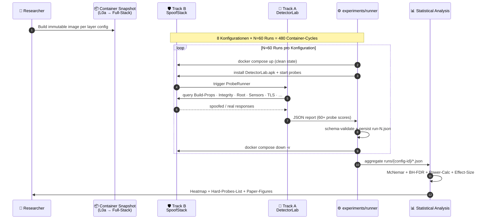
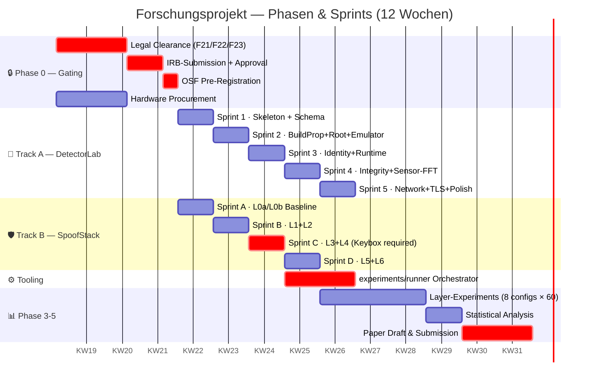
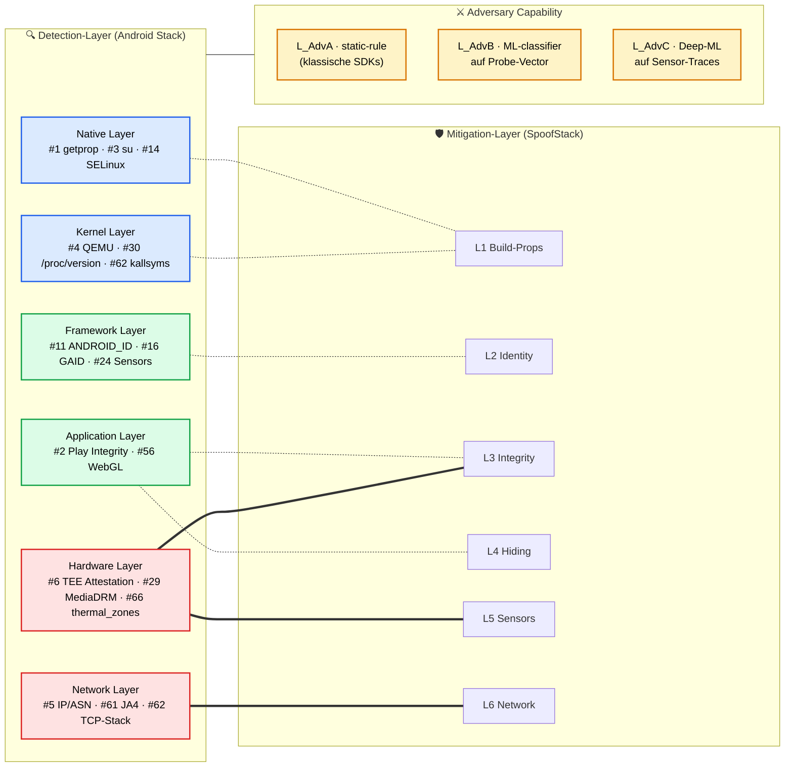
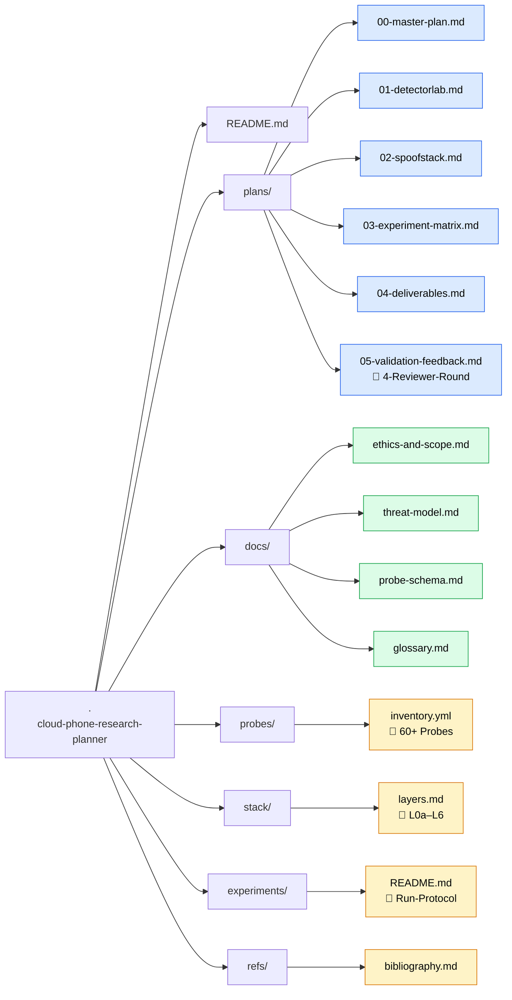
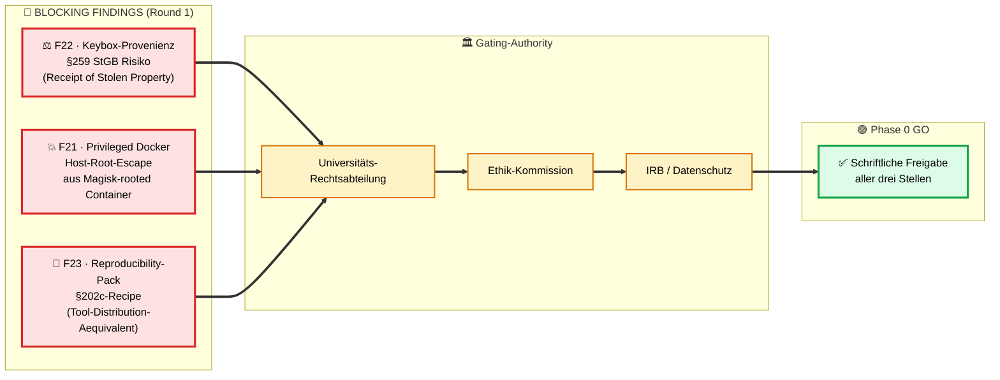
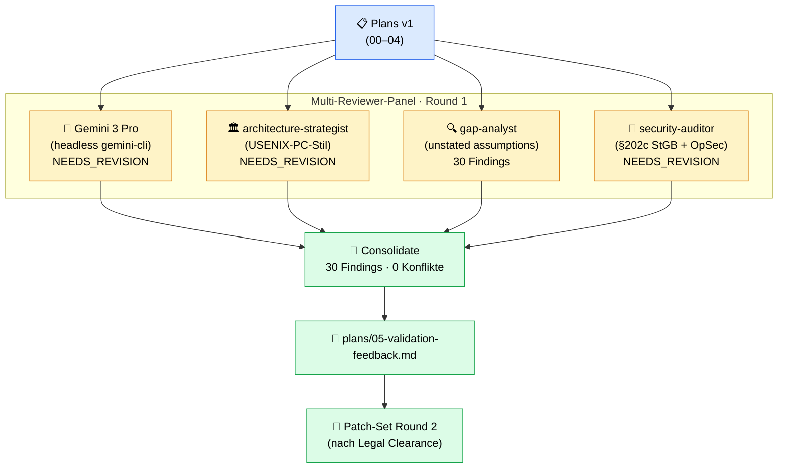

# Cloud Phone Research Planner

> Akademisches Forschungsprojekt zur empirischen, layer-weisen Evaluation der Erkennbarkeit virtualisierter Android-Umgebungen (ReDroid 12 / MobileRun-Style Cloud Phones) gegenüber App-seitiger Detection.

  
  
  
  
  
  

> **Hochschulkontext** — Dieses Repository ist die Planungs- und Tracking-App für das Forschungsvorhaben.
> Es enthält **kein** Spoofing-Tooling und **keine** Anleitungen gegen Drittsysteme. Tests laufen ausschliesslich gegen die selbstentwickelte `DetectorLab`-Suite im isolierten Lab. Live-Plattform-Tests (TikTok / Instagram / etc.) sind explizit **out of scope**.

---

## 📑 Inhaltsverzeichnis

1. [Forschungsfrage](#-forschungsfrage)
2. [Zwei-Track-Methodik](#-zwei-track-methodik)
3. [System-Architektur](#-system-architektur)
4. [Adversarial Test-Loop](#-adversarial-test-loop)
5. [12-Wochen-Phasenplan](#-12-wochen-phasenplan)
6. [Threat-Model Mapping](#-threat-model-mapping)
7. [Repository-Layout](#-repository-layout)
8. [Status & Blocker](#-status--blocker)
9. [Validation Pipeline](#-validation-pipeline)
10. [Reproducibility-Strategie](#-reproducibility-strategie)
11. [Lizenz & Ethik](#-lizenz--ethik)

---

## 🔍 Forschungsfrage

> Welche Android-Detection-Methoden (Build-Properties, Hardware-Attestation, Sensor-Signaturen, Netzwerk-Fingerprints) bleiben **robust** gegen Container-basierte Virtualisierung mit ARM-nativen Cloud-Phone-Stacks (ReDroid 12), und welche lassen sich **layer-weise schliessen**?

**Endprodukt:** Detection-Resistance-Heatmap (60+ Probes × 8 Stack-Konfigurationen) + Paper / Thesis bei USENIX Security · ACM CCS · NDSS · WOOT · DIMVA · IEEE EuroS&P.

---

## 🧪 Zwei-Track-Methodik

| Track | Rolle | Inhalt |
|---|---|---|
| **🎯 A — DetectorLab** | Red Team / Mess-Oracle | Eigene Android-App (Kotlin), die alle 60+ Detection-Punkte standardisiert misst und JSON-Reports erzeugt. Open-Source-Beitrag. |
| **🛡️ B — SpoofStack** | Blue Team / Subject Under Test | ReDroid-12-basierter Stack mit modular zuschaltbaren Mitigation-Layern (L0a → L6). Wird **gegen DetectorLab** geprüft, nicht gegen Live-Plattformen. |

Adversariell: Beide Tracks werden iterativ gegeneinander gestellt. Die Detection-Suite ist das wissenschaftliche Mess-Instrument; der Mitigation-Stack ist das Untersuchungsobjekt.

---

## 🏗️ System-Architektur

```mermaid
flowchart TB
    subgraph LAB["🔬 ISOLIERTES LABOR · eigenes VLAN · keine Live-Plattformen"]
        direction TB

        subgraph TRACKB["🛡️ TRACK B · SpoofStack · Subject Under Test"]
            direction TB
            L6["L6 · Network Egress<br/>Lab-LTE-Modem · Mobile-ASN"]
            L5["L5 · Sensor Emulation<br/>VirtualSensor + Trace-Player"]
            L4["L4 · Runtime Hiding<br/>Shamiko + HideMyAppList"]
            L3["L3 · Integrity & Attestation<br/>PIF + TrickyStore + Keybox"]
            L2["L2 · Identity Spoofing<br/>Android Faker"]
            L1["L1 · Build Properties<br/>DeviceSpoofLab Hooks/Magisk"]
            L0B["L0b · Root-Stack<br/>Magisk + ReZygisk + LSPosed"]
            L0A["L0a · Vanilla Container<br/>ReDroid 12 ARM64 Bare-Metal"]

            L0A --> L0B --> L1 --> L2 --> L3 --> L4 --> L5 --> L6
        end

        subgraph TRACKA["🎯 TRACK A · DetectorLab · Mess-Oracle"]
            direction TB
            APP["Android-App · Kotlin<br/>Min SDK 30 · Target 34"]
            CORE["ProbeRunner · 60+ Probes<br/>buildprop · integrity · root · emulator ·<br/>network · identity · runtime · sensors · ui · env"]
            REPORT["JSON Report v1<br/>Score 0.0–1.0 + Evidence + Confidence"]
            APP --> CORE --> REPORT
        end

        TRACKB == "Probe-Antworten<br/>(echt / spoofed)" ==> TRACKA
        TRACKA == "Detection-Score" ==> MATRIX
    end

    subgraph ANALYSIS["📊 AUSWERTUNG"]
        direction LR
        MATRIX["Experiment-Matrix<br/>60+ Probes × 8 Configs × N=60"]
        STATS["Statistik<br/>McNemar + Benjamini-Hochberg<br/>2⁶ Fractional-Factorial"]
        HEATMAP["Detection-Resistance<br/>Heatmap"]
        MATRIX --> STATS --> HEATMAP
    end

    subgraph DELIV["📄 DELIVERABLES"]
        direction LR
        OSS["DetectorLab OSS<br/>Apache-2.0"]
        PAPER["Paper<br/>USENIX/CCS/NDSS"]
        THESIS["Thesis-Kapitel"]
        REPRO["Reproducibility-Pack<br/>institutional access"]
    end

    LAB ==> ANALYSIS ==> DELIV

    classDef trackB fill:#fef3e0,stroke:#d97706,stroke-width:2px,color:#000
    classDef trackA fill:#dcfce7,stroke:#16a34a,stroke-width:2px,color:#000
    classDef analysis fill:#dbeafe,stroke:#2563eb,stroke-width:2px,color:#000
    classDef deliv fill:#f3e8ff,stroke:#9333ea,stroke-width:2px,color:#000

    class L0A,L0B,L1,L2,L3,L4,L5,L6 trackB
    class APP,CORE,REPORT trackA
    class MATRIX,STATS,HEATMAP analysis
    class OSS,PAPER,THESIS,REPRO deliv
```

---

## 🔁 Adversarial Test-Loop

---

## 🗓️ 12-Wochen-Phasenplan

---

## 🎯 Threat-Model Mapping

**Legende:**
- 🟥 **Hard** = externe Vertrauensanker (TEE, Mobile-Carrier) — schwer zu spoofen
- 🟩 **Soft** = App-interne API-Calls — gut hookable
- 🟦 **External** = OS-Layer-Probes — durch Container-Boundary teilweise leakend
- `===` = primärer Mitigation-Pfad · `-.-` = sekundärer Pfad

---

## 📁 Repository-Layout

---

## 🚦 Status & Blocker

| Phase | Status | Woche |
|---|---|---|
| Scope & Ethics | ✅ drafted | 1 |
| Probe Inventory | ✅ drafted (60 Probes, +14 in Round 2) | 1–2 |
| **Validation Round 1** | ⚠️ **NEEDS_REVISION** (4 Reviewer einig) | 1 |
| Legal Clearance | 🔴 **blocked** (F21 / F22 / F23) | 1 |
| DetectorLab MVP | ⏸️ blocked by F21/F22/F23 | 3–6 |
| SpoofStack Baseline | ⏸️ blocked by F21/F22 | 3–4 |
| Layer-by-Layer Experiments | 📋 planned | 7–10 |
| Paper / Thesis Draft | 📋 planned | 11–12 |

### 🚨 Top-3 Blocker vor Phase 0

Diese drei MÜSSEN vor Beginn der Implementierungsphase 1 mit Universitäts-Rechtsabteilung und Ethik-Kommission **schriftlich** geklärt sein. Details in [`plans/05-validation-feedback.md`](plans/05-validation-feedback.md).

---

## 🔬 Validation Pipeline

Der Plan wurde von **vier unabhängigen Reviewern** kreuzvalidiert (Plan-Immutability-Regel: Originale unverändert, Findings als Addendum):

| Reviewer | Tool | Verdict | Schwerpunkt |
|---|---|---|---|
| Gemini 3 Pro Preview | `gemini-cli` (headless, --skip-trust) | NEEDS_REVISION | Hardware/Statistik/TLS-Probes |
| architecture-strategist | Claude subagent | NEEDS_REVISION | Threat-Model/Reproducibility/Orchestrator |
| gap-analyst | Claude subagent | 30 Gaps | Operationale Voraussetzungen/IRB-Gating |
| security-auditor | Claude subagent | NEEDS_REVISION | §202c/§259 StGB/OpSec |
| Codex GPT-5.5 | `codex-cli` | unavailable | Usage-Limit bis 2026-05-09 |

---

## 🔁 Reproducibility-Strategie

Zwei-Stufen-Modell (gemäss Finding F23):

| Stufe | Inhalt | Zugang |
|---|---|---|
| **🟢 Public Detection-Reproducibility** | DetectorLab APK · Source · JSON-Schema · aggregate Heatmap-CSV · analysis-Scripts | öffentlich, Apache-2.0 / CC-BY |
| **🔒 Institutional Mitigation-Stack** | exakte Modul-Versionen · TrickyStore-Config · Keybox-Provenance · Container-Image-Hashes | institutional access only · verified academic request |

Damit wird **Detection-Result-Reproducibility** vollumfänglich gewährleistet, ohne dass der publizierte Reproducibility-Pack rechtlich als §202c-Recipe interpretiert werden kann.

---

## ⚖️ Lizenz & Ethik

| Aspekt | Festlegung |
|---|---|
| DetectorLab Code | Apache-2.0 |
| Probe-Schema | CC-BY-4.0 |
| Plan-Dokumente | CC-BY-4.0 |
| Stack-Konfigurationen | nur als Referenz im Lab, **nicht produktionsreif**, **nicht distributable** |
| Live-Plattform-Tests | ❌ explizit out of scope (TikTok / Instagram / etc.) |
| Drittsystem-Zugriff | ❌ kein automatisierter Zugriff |
| Disclosure-Policy | 90-Tage Coordinated · Fallback CERT-Bund/BSI |
| Rechtsrahmen | §202c StGB · §259 StGB · EU 2021/821 (Dual-Use) · DSGVO Art. 89 (Forschungsprivileg) |

Vollständig in [`docs/ethics-and-scope.md`](docs/ethics-and-scope.md).

---

## 📚 Weiterführende Dokumente

- 🗓️ [Master-Plan (12 Wochen)](plans/00-master-plan.md)
- 🎯 [Track A · DetectorLab](plans/01-detectorlab.md)
- 🛡️ [Track B · SpoofStack](plans/02-spoofstack.md)
- 📊 [Experiment-Matrix](plans/03-experiment-matrix.md)
- 📄 [Deliverables](plans/04-deliverables.md)
- ✅ [Validation Round 1 (4 Reviewer)](plans/05-validation-feedback.md)
- 🎯 [Threat-Model](docs/threat-model.md)
- ⚖️ [Ethics & Scope](docs/ethics-and-scope.md)
- 📐 [Probe-Schema v1](docs/probe-schema.md)
- 🧮 [Probe-Inventar (60+ Probes)](probes/inventory.yml)
- 🐳 [SpoofStack-Layer](stack/layers.md)
- 📚 [Bibliography](refs/bibliography.md)

---

  <em>Built with rigor. Reviewed by four. Blocked by law — until the lawyers say otherwise. 🎓</em>

