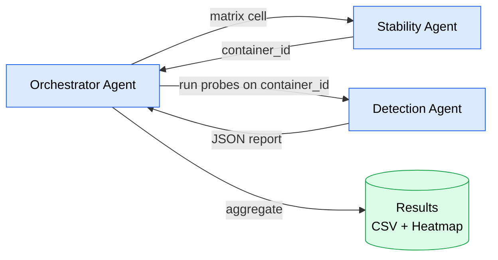

# Cloud Phone Research Planner

> Two-agent system for measuring Android container (ReDroid 12) detection-resistance against app-side fingerprinting probes.

<p align="center">
  <a href="LICENSE"></a>
  <a href="#"></a>
  <a href="#"></a>
</p>

---

## Architecture

Three agents, coordinated by a fourth orchestration layer:



| Agent | Responsibility | Owns |
|---|---|---|
| **Detection** | Run 75 detection probes against a container, emit JSON report | Kotlin DetectorLab app, probe implementations |
| **Stability** | Build/run/teardown SpoofStack container with hardened policy, monitor health | Docker compose files, layer manifests, seccomp profile |
| **Orchestrator** | Coordinate matrix execution, journal, aggregate, generate heatmap | Run journal (SQLite), aggregation scripts |

---

## Repository layout

```
.
├── .paperclip/
│   └── config.json              # Paperclip workspace definition
├── agents/
│   ├── detection/               # Detection Agent
│   │   ├── agent.yaml           # Paperclip manifest
│   │   ├── README.md
│   │   ├── SKELETON.md          # Implementation notes
│   │   └── src/                 # Kotlin sources (scaffold)
│   │       ├── core/            # Probe contract + runner
│   │       └── probes/          # Probe implementations
│   ├── stability/               # Stability Agent
│   │   ├── agent.yaml
│   │   ├── README.md
│   │   └── stack/
│   │       └── layers.md        # L0a..L6 layer definitions
│   └── orchestrator/            # Orchestrator Agent
│       ├── agent.yaml
│       ├── README.md
│       ├── SPEC.md              # 10-module Python design
│       └── EXPERIMENTS.md       # run protocol + manifest example
├── shared/                      # Read-only by all agents
│   ├── probe-schema.md          # JSON-Schema v1 for probe reports
│   ├── threat-model.md          # 8-layer Android detection model
│   └── probes/
│       └── inventory.yml        # The 75-probe inventory
├── LICENSE                      # Apache-2.0
└── README.md                    # this file
```

---

## Quickstart

### Prerequisites

- **ARM64 host** (Apple Silicon M-series, or Ampere/Graviton-class server)
- **Docker** + **Docker Compose v2**
- **Android SDK** (for `adb`) — pinned version
- **Paperclip CLI** (`paperclipai` or equivalent)
- **Real Pixel 7** (or similar) as the true-negative baseline (optional but recommended)
- **LTE modem** in the lab (only needed for L6 Network tests)

### Setup

```bash
git clone https://github.com/servas-ai/cloud-phone-research-planner.git
cd cloud-phone-research-planner

# Inspect the workspace
cat .paperclip/config.json

# Read each agent's contract
cat agents/detection/README.md
cat agents/stability/README.md
cat agents/orchestrator/README.md
```

### Running an experiment (target workflow)

```bash
# Bring up Paperclip workspace
paperclipai workspace init

# Run a single matrix cell (one config, one run)
paperclipai run orchestrator -- \
  --config L0a \
  --n 1

# Run the full matrix (8 configs × N=60 = 480 cycles)
paperclipai run orchestrator -- \
  --matrix full \
  --n 60

# Aggregate and generate heatmap
paperclipai run orchestrator -- aggregate
```

> **Note:** As of this commit, only Paperclip manifests and architecture
> skeletons exist. The Kotlin/Docker/Python implementations under
> `agents/*/src/` and `agents/stability/stack/compose/` still need to be
> written. See each agent's README for the "to make this real" checklist.

---

## What works today

- ✅ Probe-contract Kotlin scaffold (`agents/detection/src/core/`)
- ✅ Reference probe: `BuildFingerprintProbe.kt` (Probe #1)
- ✅ 75-probe inventory (`shared/probes/inventory.yml`)
- ✅ JSON-Schema v1 (`shared/probe-schema.md`)
- ✅ 8-layer threat model (`shared/threat-model.md`)
- ✅ Layer-definition document (`agents/stability/stack/layers.md`)
- ✅ Orchestrator SPEC (`agents/orchestrator/SPEC.md`) — 10-module design
- ✅ Paperclip workspace manifest (`.paperclip/config.json`)
- ✅ Three Paperclip Agent manifests

## What needs to be built

| Area | Where | Effort |
|---|---|---|
| DetectorLab Gradle setup | `agents/detection/` | M |
| Implement 74 remaining probes | `agents/detection/src/probes/` | L |
| Docker compose files for L0a..L6 | `agents/stability/stack/compose/` | M |
| Seccomp profile + healthcheck | `agents/stability/stack/` | S |
| Orchestrator Python implementation | `agents/orchestrator/src/` | M |
| Inter-agent communication wiring | Paperclip API | S |
| End-to-end smoke test (Probe #1 → L0a → score) | all | M |
| ARM64 lab host + Pixel 7 baseline + LTE modem | hardware | hardware |

---

## Hard rules

1. No illegal packages (license-incompatible or pirated dependencies).
2. No emoji-bombing in code files.

---

## License

Apache-2.0. See `LICENSE`.
