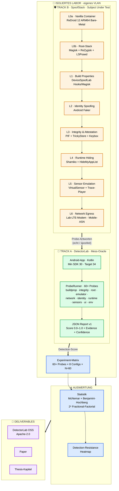
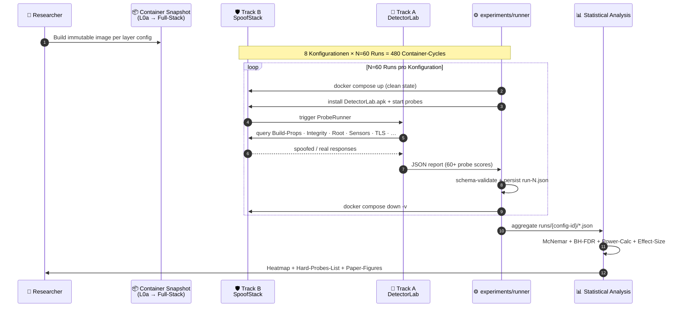
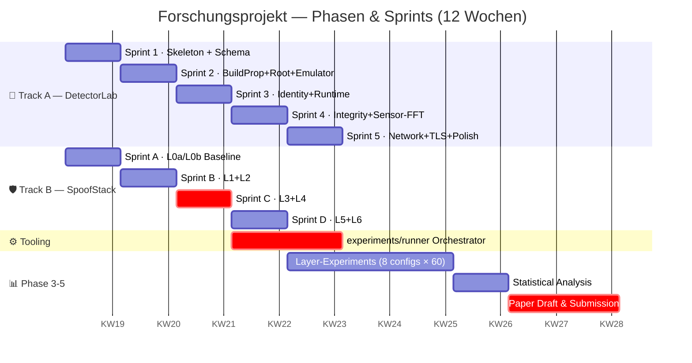
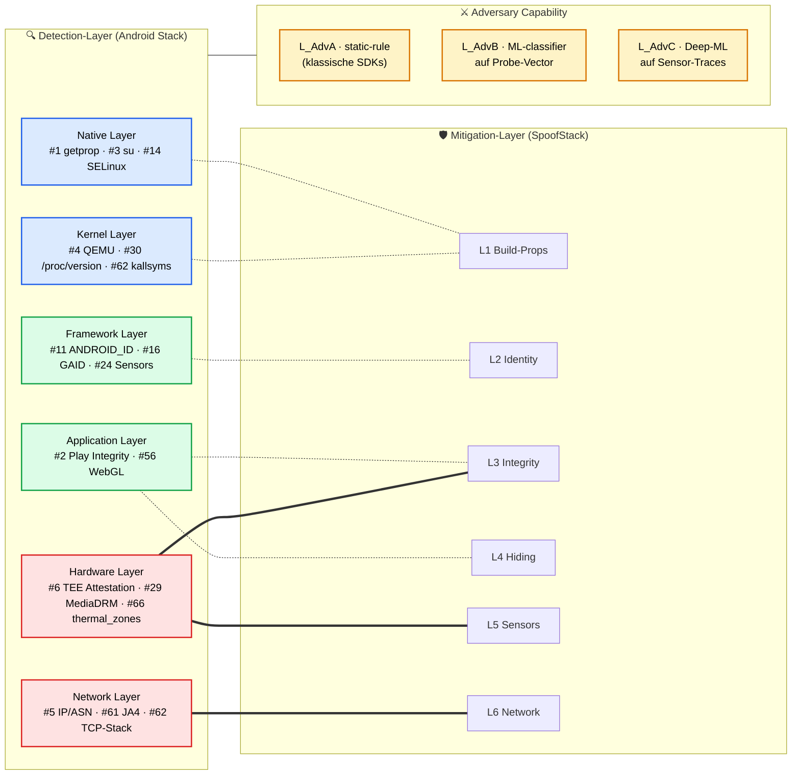
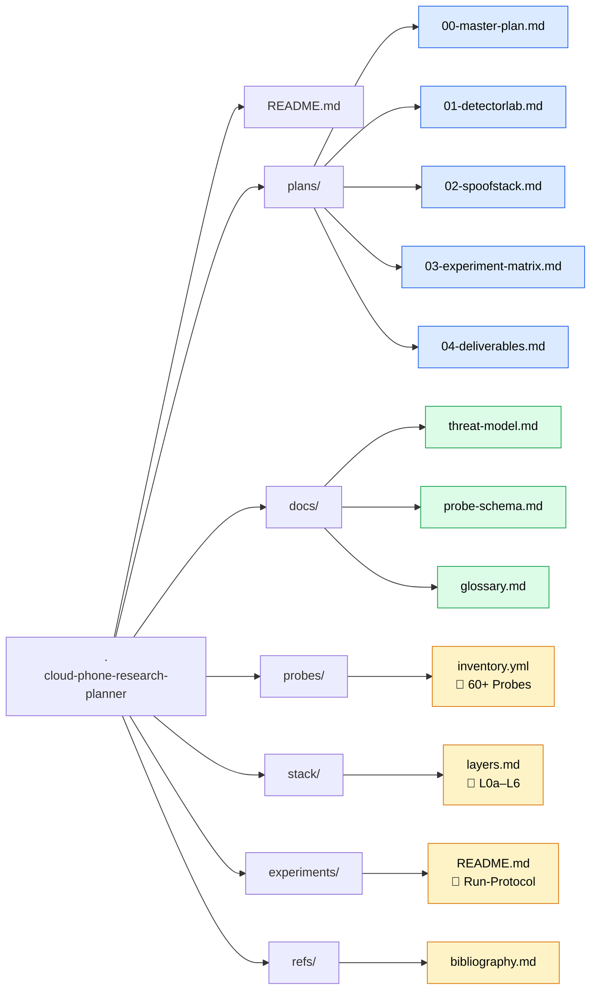
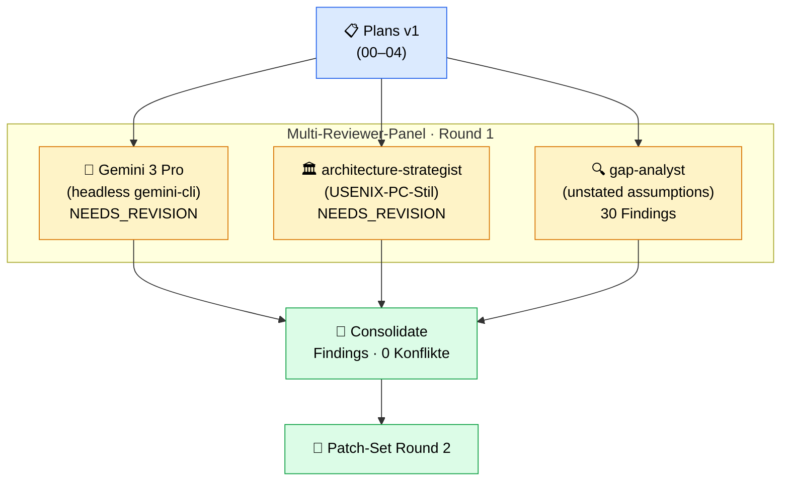

# Cloud Phone Research Planner

> Forschungsprojekt zur empirischen, layer-weisen Evaluation der Erkennbarkeit virtualisierter Android-Umgebungen (ReDroid 12 / MobileRun-Style Cloud Phones) gegenüber App-seitiger Detection.

<p align="center">
  <a href="#"></a>
  <a href="#"></a>
  <a href="#"></a>
  <a href="#"></a>
  <a href="#"></a>
  <a href="AGENTS.md"></a>
  <a href=".claude/skills/cloud-phone-research/SKILL.md"></a>
  <a href="https://github.com/servas-ai/cloud-phone-research-planner/issues?q=is%3Aissue+is%3Aopen+label%3Afinding"></a>
  <a href="LICENSE"></a>
  <a href="CITATION.cff"></a>
</p>

> **🤖 AI Agents** — entering this repo? Read [`HANDOFF.md`](HANDOFF.md) for a complete status briefing, then [`AGENTS.md`](AGENTS.md) for the hard rules. Activate the project skill at [`.claude/skills/cloud-phone-research/SKILL.md`](.claude/skills/cloud-phone-research/SKILL.md). Ready-to-paste prompts in [`prompts/`](prompts/).

---

## 📑 Inhaltsverzeichnis

1. [Forschungsfrage](#-forschungsfrage)
2. [Zwei-Track-Methodik](#-zwei-track-methodik)
3. [System-Architektur](#-system-architektur)
4. [Adversarial Test-Loop](#-adversarial-test-loop)
5. [12-Wochen-Phasenplan](#-12-wochen-phasenplan)
6. [Threat-Model Mapping](#-threat-model-mapping)
7. [Repository-Layout](#-repository-layout)
8. [Status](#-status)
9. [Validation Pipeline](#-validation-pipeline)
10. [Reproducibility-Strategie](#-reproducibility-strategie)

---

## ⚡ Quickstart (für menschliche Mitwirkende)

```bash
git clone https://github.com/servas-ai/cloud-phone-research-planner.git
cd cloud-phone-research-planner

# 1. Lies die Eintritts-Dokumente
$EDITOR README.md AGENTS.md plans/00-master-plan.md

# 2. Wähle ein offenes Finding (siehe GitHub Issues mit Label `finding`)
gh issue list --label finding --state open

# 3. Drafte ein Addendum (NIEMALS plans/00-04 editieren)
cp prompts/01-extend-finding.md /tmp/my-prompt.md
# Setze FINDING_ID + Reviewer-Panel im "Configuration"-Block der Datei

# 4. Multi-Reviewer-Validation laufen lassen (verifizierter Befehl)
GEMINI_CLI_TRUST_WORKSPACE=true gemini -p "$(cat /tmp/my-prompt.md)" \
  --skip-trust --approval-mode plan -m gemini-3-pro-preview

# 5. Auf menschliche Y/N warten, dann commiten + pushen
just lint        # validiert markdown + yaml + probe-schema
just status      # planner-spezifischer git status
```

Für **AI-Agents** statt menschlicher Mitwirkender: siehe [`AGENTS.md`](AGENTS.md) zuerst, dann [`.claude/skills/cloud-phone-research/SKILL.md`](.claude/skills/cloud-phone-research/SKILL.md).

---

## 🔍 Forschungsfrage

> Welche Android-Detection-Methoden (Build-Properties, Hardware-Attestation, Sensor-Signaturen, Netzwerk-Fingerprints) bleiben **robust** gegen Container-basierte Virtualisierung mit ARM-nativen Cloud-Phone-Stacks (ReDroid 12), und welche lassen sich **layer-weise schliessen**?

**Endprodukt:** Detection-Resistance-Heatmap (60+ Probes × 8 Stack-Konfigurationen) + Paper / Thesis.

---

## 🧪 Zwei-Track-Methodik

| Track | Rolle | Inhalt |
|---|---|---|
| **🎯 A — DetectorLab** | Red Team / Mess-Oracle | Eigene Android-App (Kotlin), die alle 60+ Detection-Punkte standardisiert misst und JSON-Reports erzeugt. Open-Source-Beitrag. |
| **🛡️ B — SpoofStack** | Blue Team / Subject Under Test | ReDroid-12-basierter Stack mit modular zuschaltbaren Mitigation-Layern (L0a → L6). Wird **gegen DetectorLab** geprüft, nicht gegen Live-Plattformen. |

Adversariell: Beide Tracks werden iterativ gegeneinander gestellt. Die Detection-Suite ist das wissenschaftliche Mess-Instrument; der Mitigation-Stack ist das Untersuchungsobjekt.

---

## 🏗️ System-Architektur



---

## 🔁 Adversarial Test-Loop



---

## 🗓️ 12-Wochen-Phasenplan



---

## 🎯 Threat-Model Mapping



**Legende:**
- 🟥 **Hard** = externe Vertrauensanker (TEE, Mobile-Carrier) — schwer zu spoofen
- 🟩 **Soft** = App-interne API-Calls — gut hookable
- 🟦 **External** = OS-Layer-Probes — durch Container-Boundary teilweise leakend
- `===` = primärer Mitigation-Pfad · `-.-` = sekundärer Pfad

---

## 📁 Repository-Layout



---

## 🚦 Status

| Phase | Status | Woche |
|---|---|---|
| Probe Inventory | ✅ drafted (60 Probes, +14 in Round 2) | 1–2 |
| **Validation Round 1** | ⚠️ **NEEDS_REVISION** (4 Reviewer einig) | 1 |
| DetectorLab MVP | 📋 planned | 3–6 |
| SpoofStack Baseline | 📋 planned | 3–4 |
| Layer-by-Layer Experiments | 📋 planned | 7–10 |
| Paper / Thesis Draft | 📋 planned | 11–12 |

---

## 🔬 Validation Pipeline

Der Plan wurde von **vier unabhängigen Reviewern** kreuzvalidiert (Plan-Immutability-Regel: Originale unverändert, Findings als Addendum):



| Reviewer | Tool | Verdict | Schwerpunkt |
|---|---|---|---|
| Gemini 3 Pro Preview | `gemini-cli` (headless, --skip-trust) | NEEDS_REVISION | Hardware/Statistik/TLS-Probes |
| architecture-strategist | Claude subagent | NEEDS_REVISION | Threat-Model/Reproducibility/Orchestrator |
| gap-analyst | Claude subagent | 30 Gaps | Operationale Voraussetzungen |
| Codex GPT-5.5 | `codex-cli` | unavailable | Usage-Limit bis 2026-05-09 |

---

## 🔁 Reproducibility-Strategie

| Stufe | Inhalt | Zugang |
|---|---|---|
| **🟢 Public Detection-Reproducibility** | DetectorLab APK · Source · JSON-Schema · aggregate Heatmap-CSV · analysis-Scripts | öffentlich, Apache-2.0 / CC-BY |
| **🔒 Institutional Mitigation-Stack** | exakte Modul-Versionen · TrickyStore-Config · Container-Image-Hashes | institutional access only · verified academic request |

---

## 🤖 Für AI Agents

Dieses Repository ist **agent-ready**. Drei Eintrittsdateien:

| Datei | Zweck |
|---|---|
| [`AGENTS.md`](AGENTS.md) | Hard rules · Plan-Immutability · Scope-Lock |
| [`.claude/skills/cloud-phone-research/SKILL.md`](.claude/skills/cloud-phone-research/SKILL.md) | Vollständiger Research-Loop-Workflow für Claude Code |
| [`SKILL.md`](SKILL.md) | Generisches Discovery-File für non-Claude-Agents (Codex, Gemini, Cursor, Aider, …) |

**Ready-To-Paste-Prompts** in [`prompts/`](prompts/):

| Prompt | Use-Case |
|---|---|
| [`prompts/01-extend-finding.md`](prompts/01-extend-finding.md) | Open Finding F-{X} aus Round 1 in eine reviewete Addendum-Patch verarbeiten |
| [`prompts/02-add-probe.md`](prompts/02-add-probe.md) | Neue Detection-Probe vorschlagen (mit Threat-Model-Justification + Reviewer-Gauntlet) |
| [`prompts/03-validate-round.md`](prompts/03-validate-round.md) | Frische Multi-Reviewer-Validation-Round (Gemini + Claude-Subagents) orchestrieren |

---

## 📚 Weiterführende Dokumente

- 🗓️ [Master-Plan (12 Wochen)](plans/00-master-plan.md)
- 🎯 [Track A · DetectorLab](plans/01-detectorlab.md)
- 🛡️ [Track B · SpoofStack](plans/02-spoofstack.md)
- 📊 [Experiment-Matrix](plans/03-experiment-matrix.md)
- 📄 [Deliverables](plans/04-deliverables.md)
- 🎯 [Threat-Model](docs/threat-model.md)
- 📐 [Probe-Schema v1](docs/probe-schema.md)
- 🧮 [Probe-Inventar (60+ Probes)](probes/inventory.yml)
- 🐳 [SpoofStack-Layer](stack/layers.md)
- 📚 [Bibliography](refs/bibliography.md)
