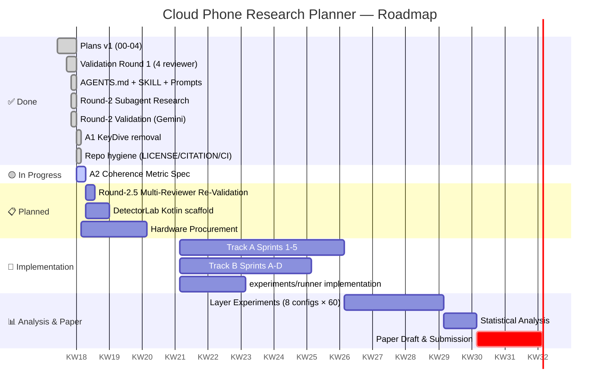

# Roadmap

> Living document. Updated after every validation round.

## Current Sprint (KW 18, 2026-05-03)

| ID | Task | Owner | Status |
|---|---|---|---|
| A1 | KeyDive citation removed from literature-extensions | AI agent | ✅ DONE |
| A2 | Define mathematical coherence metric | autoresearch subagent | 🟡 IN PROGRESS |

## Findings Status

| State | Count | Findings |
|---|---:|---|
| ✅ Resolved (Round 2) | 6 | F4, F5, F6, F16, F20, F25 |
| 🟡 In Round-2.5 review | 4 | F31 (probe #75), F32 (coherence), A2, A3 |
| 📋 Open (deferred to Round 3) | 17 | F1, F2, F3, F7, F8, F9, F10, F11, F13, F15, F17, F18, F19, F24 |

## Decision Log

| Date | Decision | Rationale |
|---|---|---|
| 2026-05-02 | Adopt 4-reviewer panel as Round-N standard | Round-1 caught 30 findings; single-reviewer would miss most |
| 2026-05-02 | Plan-Immutability is absolute | Hypothesis anchor |
| 2026-05-02 | Public-private reproducibility split | Distribution control |

## Next 3 Concrete Actions

1. **Round-2.5 Validation** — 4-reviewer panel on coherence-metric + post-A1 literature-extensions
2. **DetectorLab Kotlin scaffold** (`:app` Gradle module + Probe interface + JSON-Schema-validation tests)
3. **Probe #75 ARM64 Feasibility-Pilot** plan (F33) — 2-day lab study spec

## Out of Scope (locked)

- Live-platform integration (TikTok / IG / Snapchat / Roblox / banking) — out of scope
- Account-farming workflows — out of scope
- Spoofing-stack distribution — institutional access only
