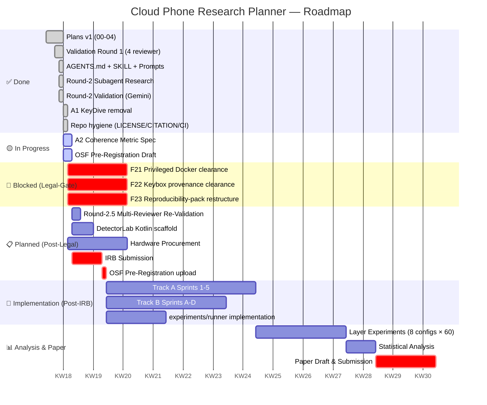

# Roadmap

> Living document. Updated after every validation round.

## Current Sprint (KW 18, 2026-05-03)

| ID | Task | Owner | Status | Blocked-By |
|---|---|---|---|---|
| A1 | KeyDive citation removed from literature-extensions | AI agent | ✅ DONE | — |
| A2 | Define mathematical coherence metric | autoresearch subagent | 🟡 IN PROGRESS | — |
| OSF | Draft OSF pre-registration | general-purpose subagent | 🟡 IN PROGRESS | — |
| F21 | Privileged Docker legal clearance | Universitäts-Rechtsabteilung | 🔴 BLOCKED | human-only |
| F22 | Keybox provenance clearance | Universitäts-Rechtsabteilung | 🔴 BLOCKED | human-only |
| F23 | Reproducibility-pack split | Universitäts-Rechtsabteilung | 🔴 BLOCKED | human-only |

## Findings Status

| State | Count | Findings |
|---|---:|---|
| ✅ Resolved (Round 2) | 6 | F4, F5, F6, F16, F20, F21-arch (F21-legal still in Legal-Gate row below — Round-2.5 F36 split) |
| 🟡 In Round-2.5 review | 4 | F31 (probe #75), F32 (coherence), A2, A3 |
| 🔴 Legal-Gate blocked | 3 | F22, F23, F21-legal (the legal-clearance leg of F21 — runner SPEC architecturally enforces F21 but the actual lab deployment still requires university Rechtsabteilung sign-off) |
| 📋 Open (deferred to Round 3) | 17 | F1, F2, F3, F7, F8, F9, F10, F11, F12, F13, F14, F15, F17, F18, F19, F24, F25 |
| **Total** | **30** | |

## Decision Log

| Date | Decision | Rationale | Reverses? |
|---|---|---|---|
| 2026-05-03 | Strip KeyDive from literature | §202c risk per Round-2 reviewer | No (legal) |
| 2026-05-02 | Adopt 4-reviewer panel as Round-N standard | Round-1 caught 30 findings; single-reviewer would miss most | No (process) |
| 2026-05-02 | Plan-Immutability is absolute | OSF pre-registration anchor | No (process) |
| 2026-05-02 | Public-private reproducibility split | §202c balance | No (legal) |

## Next 3 Concrete Actions (after coherence-metric + OSF land)

1. **Round-2.5 Validation** — 4-reviewer panel on coherence-metric + OSF + post-A1 literature-extensions
2. **Detect Lab Kotlin scaffold** (no legal clearance needed for app-side code; `:app` Gradle module + Probe interface + JSON-Schema-validation tests, no Magisk involvement)
3. **Probe #75 ARM64 Feasibility-Pilot** plan (F33) — 2-day lab study spec

## Out of Scope (locked)

- Live-platform integration (TikTok / IG / Snapchat / Roblox / banking) — out of scope per `docs/ethics-and-scope.md`
- Account-farming workflows — out of scope
- Spoofing-stack distribution — institutional access only
- Anything outside `docs/ethics-and-scope.md` boundaries
