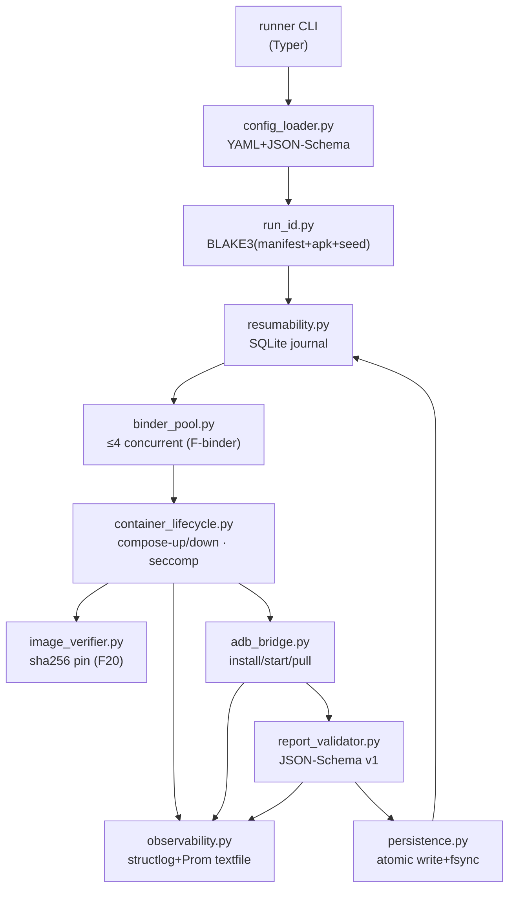
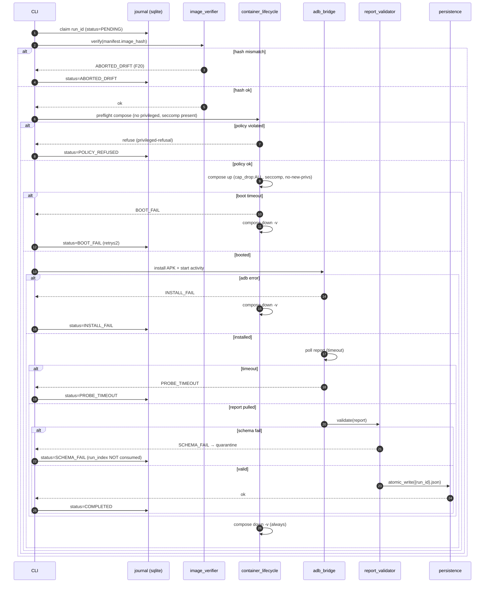

# experiments/runner — Specification

Status: DRAFT (Architecture)
Author: lead-software-architect subagent
Date: 2026-05-02
Triggered by: Finding F16 (architecture-strategist + gap-analyst)
For: human review before any code is written
Constraints honored: F11 (resumable runs), F16 (orchestrator), F20 (image-hash verify)

> Non-modification disclaimer: this SPEC does not edit `plans/00–04`, `experiments/README.md`,
> `stack/layers.md`, or any frozen artifact. It lives only at `experiments/runner/SPEC.md`.

## 1. Design Goals

1. **Bias-free orchestration** — eliminate operator drift across 7+ configs × 30+ runs (F16).
2. **Bit-reproducibility per run** — same `manifest.yml` + same image-hash + same APK-hash → identical run conditions.
3. **Schema-gated persistence** — no JSON report touches `runs/{config-id}/` until JSON-Schema v1 validation passes.
4. **Hardening** — runner refuses to start a container whose compose file declares `privileged: true`. Mandatory `seccomp` profile, `cap_drop: [ALL]` plus minimal `cap_add`, `no-new-privileges`.
5. **F20-safe drift control** — image-hash pin verified at every run; `--pull=never` Docker policy; runner aborts if `image_digest != manifest.container_image_hash`.
6. **OOM-resumable** — every run yields an idempotent run-ID; partial runs leave a journal entry that `--resume` consumes without duplicate runs (F11 edge-case).
7. **Operator hands-off** — single CLI entry point starts the full 210+ run cycle; success/fail rate exposed via Prometheus textfile + structured JSON log.
8. **ARM64 Bare-Metal target** — no x86 emulation, no Apple Silicon assumption (F2). Tested on Ampere/Graviton-class host.

## 2. Non-Goals

- Building/installing SpoofStack modules (handled by `stack/` upstream image-build pipeline).
- Statistical analysis (handled by `experiments/analysis/`).
- Keybox handling (institutional repo only).
- Live-platform tests.
- Cross-host distributed runs (single ARM64 host, ≤ 4 concurrent containers).

## 3. Architecture Diagram (Mermaid)



## 4. Module Breakdown

| Module | Responsibility | LOC est. |
|---|---|---|
| `runner.py` | Typer entry point, sub-commands `run`/`aggregate`/`verify`. No business logic. | 120 |
| `config_loader.py` | Load + JSON-Schema-validate `manifest.yml`. Refuse unknown keys. | 90 |
| `run_id.py` | Deterministic ID = `BLAKE3(manifest_canonical_json ‖ apk_sha256 ‖ run_index ‖ schema_version)` → 16-char b32. | 50 |
| `container_lifecycle.py` | docker-compose up/down via `python-on-whales`. Refuses `privileged:true`. Injects `seccomp:redroid-seccomp.json`, `cap_drop:[ALL]`, `cap_add:[SYS_ADMIN]`, `no-new-privileges`. | 220 |
| `image_verifier.py` | `docker image inspect` digest vs `manifest.container_image_hash`. Hard-fail on mismatch (F20). | 60 |
| `adb_bridge.py` | Talk-to-container via `adb connect <ip>:5555`. Install APK, start activity, poll for `/sdcard/Download/detectorlab-report.json`. Timeout-bounded. | 180 |
| `report_validator.py` | Validate against `probes/v1-schema.json`. Reject if probe count < expected, schemaVersion mismatch, evidence missing. | 80 |
| `persistence.py` | Atomic write (tmp + fsync + rename) into `experiments/runs/{config-id}/{run-id}.json`. Refuse overwrite. | 70 |
| `resumability.py` | SQLite journal `runs/.journal.db`: `(run_id, config_id, status, started_at, finished_at, error)`. `--resume` skips `status=COMPLETED`. | 130 |
| `binder_pool.py` | Semaphore (default=4) over `/dev/binder*` devices (binder, hwbinder, vndbinder). | 60 |
| `observability.py` | `structlog` JSON to stdout + file; Prometheus textfile (`runs_total`, `runs_failed`, `validation_failed`). | 90 |

Total estimate: **~1,150 LOC** (excluding tests and docstrings).

## 5. Manifest Format (YAML schema)

```yaml
schema_version: "runner.v1"           # validated against runner-manifest.schema.json
config_id: "L0-L1-L2"                 # str, [a-zA-Z0-9._-], unique
created: "2026-06-15T00:00:00Z"
container_image_hash: "sha256:abc..." # F20 pin (mandatory)
compose_file: "stack/L0-L1-L2/docker-compose.yml"
seccomp_profile: "stack/redroid-seccomp.json"  # mandatory
detector_lab_apk: "experiments/apk/detectorlab-0.1.0.apk"
detector_lab_apk_hash: "sha256:def..."
target_runs: 30                       # N
warmup_seconds: 30
probe_timeout_seconds: 240
binder_device: "/dev/binder"
seed: "0x9c3a..."                     # entropy source for run_id derivation
modules: { ... }                      # informational; not used by runner
```

A separate `runner-manifest.schema.json` (JSON-Schema 2020-12) lives next to `SPEC.md`; `config_loader` uses it.

## 6. Run-ID Generation (deterministic, hash-based)

```
canonical = canonical_json(manifest_minus_modules)
material  = canonical ‖ apk_sha256 ‖ uint32_be(run_index) ‖ schema_version
run_id    = base32(BLAKE3(material))[:16].lower()
```

Properties:
- Pure function — same inputs → same run_id (idempotent).
- Collision-resistant within experiment lifetime (BLAKE3-256 truncated to 80 bits).
- Independent of wall-clock, hostname, PID — survives OOM-restart (F11).

## 7. Failure Modes & Recovery

| Failure | Detection | Action |
|---|---|---|
| Image-hash mismatch | `image_verifier` | Abort run; journal `status=ABORTED_DRIFT` (F20) |
| `privileged:true` in compose | `container_lifecycle` pre-check | Refuse; exit code 78 (privileged-refusal) |
| Container fails to boot ≤ 90 s | adb-connect retry loop | Mark `status=BOOT_FAIL`; retry up to 2× |
| ADB install failure | exit code | Mark `status=INSTALL_FAIL`; tear down; next run |
| Probe report not produced ≤ timeout | filesystem poll | Mark `status=PROBE_TIMEOUT`; pull logs |
| Schema-validation fails | `report_validator` | Quarantine to `runs/{config-id}/.quarantine/{run-id}.json`; do not count toward N |
| Persistence collision | `persistence` | Hard-fail (run_id collision = bug) |
| Host OOM mid-run | journal recovery on `--resume` | Replay only `status in (PENDING, RUNNING)` |
| Binder-pool exhausted | `binder_pool` semaphore | Block (no busy-wait) |

## 8. CLI Interface

```
runner run --config L0-L1-L2 --runs 30 [--resume] [--concurrency 4] [--dry-run]
runner aggregate --config L0-L1-L2 [--out runs.csv]
runner verify --image-hash sha256:abc... [--compose stack/L0-L1-L2/docker-compose.yml]
runner journal --config L0-L1-L2 [--show ABORTED_DRIFT|BOOT_FAIL|...]
```

Exit codes: 0 success · 64 bad-CLI · 65 manifest-invalid · 78 policy-refused (privileged-refusal) · 70 internal.

## 9. Schema-Validation Pipeline

1. `report_validator` loads `probes/v1-schema.json` once at process start.
2. Per pulled report: `jsonschema.Draft202012Validator(schema).validate(report)`.
3. Additional invariants (not in schema):
   - `len(report.probes) ≥ probe_inventory.expected_count`
   - `report.schemaVersion == "1.0"` (F15-aware: enum forward-compat handled here when schema is updated).
   - `report.aggregate.weightedScore` recomputed and compared (within ε=1e-9).
4. On failure: report is moved to `.quarantine/`, journal entry `status=SCHEMA_FAIL`, run_index NOT consumed.

## 10. Concurrency Model (binder-device-aware, max 4 containers)

- Hard cap: 4 simultaneous containers per binder device (per `stack/layers.md` L0).
- `asyncio` event loop with bounded semaphore.
- Each container gets unique compose project name `${config_id}-${run_id_short}`.
- ADB ports allocated from a pool `[5555..5755]` step 2 (5555 odd-only) tracked in journal.
- One container = one ADB-server scope (no shared `adb-server`); avoids cross-talk.

## 11. Observability (logs, metrics, run-progress)

- `structlog` JSON lines → stdout + `runs/.logs/{date}.ndjson`.
- Prometheus textfile collector at `runs/.metrics/runner.prom`:
  - `runner_runs_total{config_id,status}`
  - `runner_run_duration_seconds_bucket{...}`
  - `runner_validation_failures_total`
  - `runner_image_hash_mismatches_total` (F20 alert)
- Live progress: `rich` progress bar, suppressible with `--no-tty` for CI.

## 12. Test Strategy (unit + integration without real ReDroid)

Unit (no Docker, no ADB):
- `run_id` determinism / collision smoke test (10⁶ inputs).
- `config_loader` schema rejection (positive + negative cases).
- `container_lifecycle.preflight` rejects `privileged:true` (regression test).
- `image_verifier` mismatch handling (mocked `docker image inspect`).
- `report_validator` happy-path + 12 malformed fixtures.

Integration (ephemeral, no real SpoofStack):
- `redroid-mock` test container = busybox + minimal `adb` listener + canned report.
- Runs full lifecycle without Magisk/LSPosed.
- Covers `--resume` after SIGKILL mid-run.
- Concurrency test with `concurrency=4` against 4 mock containers.

End-to-end:
- Single L0a run on real ReDroid, behind `RUN_E2E=1` env flag.
- Never wired to CI — manual operator only.

## 13. Sequence Diagram — Single Run Cycle (with error branches)



## 14. Language Choice — Python (justified)

- Data-science ecosystem (`pandas`, `pyarrow`, `jsonschema`, `python-on-whales`, `adbutils`) directly reusable by `experiments/analysis/`.
- AsyncIO sufficient for I/O-bound concurrency at N=4.
- ARM64 wheels readily available for all listed deps.
- Alternative considered: Go (single-binary deploy) — rejected because downstream stats pipeline is Python; cross-language artifacts add reproducibility cost without benefit at this scale.

## 15. Estimated Effort

| Item | Days |
|---|---|
| Module implementation (~1,150 LOC) | 4 |
| JSON-Schema authoring + tests | 1 |
| Mock-ReDroid integration harness | 2 |
| Resumability journaling + crash tests | 1 |
| Observability + Prom textfile | 0.5 |
| Documentation (`README.md`, runbook) | 1 |
| Code review + adversarial round | 1.5 |
| **Total** | **~11 person-days** |

Aligns with the 14-day Gantt block (`run` task in `README.md` 12-week plan).

## 16. Open Questions for Human Partner

1. Concurrency cap: confirm **4** containers per binder device on chosen ARM64 host, or measure during Sprint A?
2. Image registry: pin via local mirror (preferred for F20 immutability) or upstream `docker.io/redroid/redroid` with `--pull=never`?
3. Quarantine retention: keep schema-failed reports indefinitely, or rotate after N=100?
4. Should `--resume` automatically skip `ABORTED_DRIFT` runs, or require explicit `--include-aborted`?
5. Prom textfile: is a node_exporter present on the lab host, or should we ship a minimal pushgateway?
6. Is the ADB binary version pinned in the lab image? Differing ADB clients can produce inconsistent `pull` behavior.
7. Do we need a wall-clock-based **kill switch** (e.g., abort any single run > 15 min) on top of probe-timeout?

## 17. Implementation Gate

This SPEC is design-only.

---

**Approved to begin implementation? Y / N**
