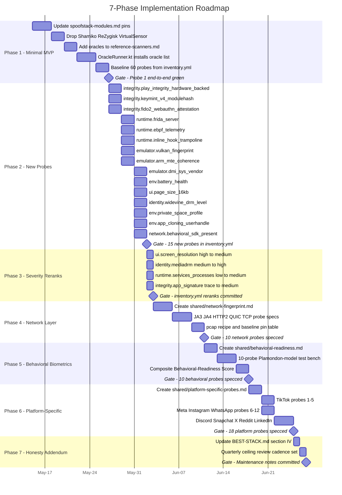
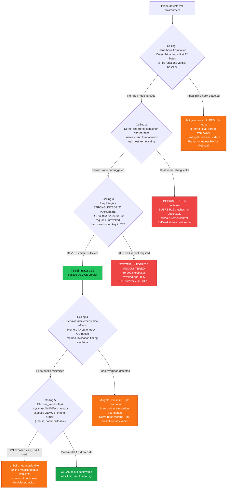
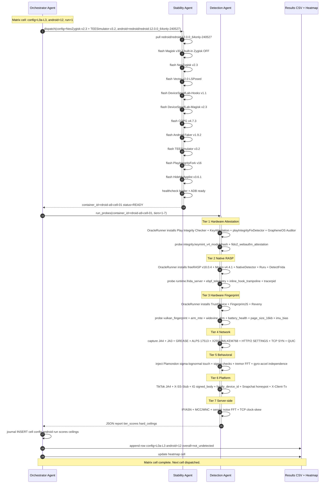

# Best Detection & Defense Stack — May 2026 (v2, post-validation-round-3)

> **Multi-agent consensus** from 10 specialized research agents (Oracle validation,
> Defense module validation, New detection vectors, MiniMax cross-review, 5
> platform/network/behavioral/RASP deep-dives) + **17-agent validation Round 3**
> (A1..A17). This document is the **single source of truth** for what the Tester
> (Detection Agent) should probe and what the SpoofStack (Stability Agent) should
> compose. All claims cite sources.
>
> **Generated**: 2026-05-15 · **Consensus**: 10 agents + 17 validators
> · **Status**: pre-implementation reference, v2 corrections applied.

---

## TL;DR

The Detection Agent runs **7 tiers** of probes (≈109 probes total = 60 baseline
+ 11 new attestation/runtime probes + 18 platform-specific + 10 network-layer +
10 behavioral-biometrics). The SpoofStack pivots from the documented stack
(12 months stale) to a **NeoZygisk + TEESimulator + Vector** baseline. **Five
detection axes are uncountered by any FOSS-only defense in 2026** (inline-hook
trampoline, kernel fingerprint (container-shared-host), Play Integrity STRONG,
behavioral telemetry, DMI host-vendor leak — the last is unbuilt, not unbuildable).
Plus **4 new ceilings/candidates** discovered in Round 3.

---

## I. The Tester (Detection Agent) Stack

The Detection Agent measures on **7 independent tiers**. A SpoofStack is only
"provisionally undetected" when **all 7 tiers** simultaneously return CLEAN
against a vanilla measurement.

### Tier 1 — Hardware Attestation (Ground Truth)

These cannot be bypassed without a genuine TEE + valid attestation chain.

| Oracle / Probe | Source | Detects |
|---|---|---|
| **Play Integrity Checker** (1nikolas) | github.com/1nikolas/play-integrity-checker-app | BASIC / DEVICE / STRONG verdict + new `deviceRecall` + `appAccessRiskVerdict` |
| **GrapheneOS Auditor** | github.com/GrapheneOS/Auditor | TEE-signed device info, cannot be bypassed by OS modification |
| **KeyAttestation** (vvb2060) v1.8.4 | github.com/vvb2060/KeyAttestation | X.509 chain → OID 1.3.6.1.4.1.11129.2.1.17 → RootOfTrust + VerifiedBootState |
| **playIntegrityFixDetector** (IR0NBYTE) v2.2 | github.com/IR0NBYTE/playIntegrityFixDetector | **Adversarial** — explicitly detects PIF/TrickyStore spoofing |
| `integrity.keymint_v4_modulehash` (NEW probe) | source.android.com/docs/security/features/keystore/attestation | KeyMint v4 (Feb-Apr 2026) `moduleHash` + ECDSA P-384 root |
| `integrity.fido2_webauthn_attestation` (NEW probe) | android-developers.googleblog.com/2024/09/attestation-format-change-for-android-fido2-api.html | Nov 2024 hardware-bound passkey attestation |

**Consensus call**: STRONG_INTEGRITY is the **single hardest ceiling**. Even
TEESimulator + valid leaked Pixel keybox passes only Device, not Strong.
Pre-2023 Pixel 4/5/6 keyboxes were revoked April 2025 (CT log rotation).
**RKP cutover 2026-04-10** invalidated all pre-cutover keyboxes.

### Tier 2 — Native RASP & Tamper Detection

What banking apps actually run. Read `/proc/self/maps`, port-scan, hash libc
function prologues — all via raw syscalls bypassing libc hooks.

| Oracle / Probe | Detects | Defeated by |
|---|---|---|
| **freeRASP / Free-RASP-Android** (Talsec) Android **v18.0.4 (2026-02-24)** / Flutter v8.1.0 | Magisk, Frida, **KernelSU** (NEW v18), SUSFS, Shamiko, hookers, VPN, app-clone, debug, 16KB-page-coherence, automation, time/location-spoofing, multi-instance, screen-recording, unsecure-wifi | partial: NeoZygisk |
| **Momo** v4.4.1 (still active 2026-05) | Zygote injection, init.rc, /system/vendor/overlay, Magisk-UDS, SELinux | NeoZygisk hides modern Zygisk; **misses KernelSU artifacts** |
| **NativeDetector** (Dr-TSNG) | Inline-hooks, GOT manipulation, syscall errno-pattern deviation | partial |
| **Ruru** (byxiaorun) | SUSFS-aware (April 2026 patched NativeDetector's evasion) | NeoZygisk + monthly module-refresh |
| **DetectFrida** (darvincisec) | Inline-hook trampoline (first 32 bytes of libc fns hashed vs disk baseline) | **UNCOUNTERED** — see §V |
| `runtime.frida_server` (NEW) | port 27042/27043, `gum-js-loop`/`gmain` thread names, `linjector` in maps | NeoZygisk (gadget mode) |
| `runtime.ebpf_telemetry` (NEW) | `/sys/fs/bpf/` enumeration, pinned BPF programs (ThreatMetrix 2024+) | **UNCOUNTERED** |
| `runtime.debugger_tracerpid` (NEW) | `/proc/self/status` TracerPid nonzero from NeoZygisk ptrace-injection window | partial: NeoZygisk v2.3 PTRACE_DETACH |

### Tier 3 — Probabilistic Hardware Fingerprint

Soft signals that aggregate into device-class identification.

| Oracle / Probe | Detects |
|---|---|
| **TrustDevice-Android** v1.1.4 (Dec 2025) | gsfId, MediaDRM ID, vbMetaDigest, abiType, cpuHardware coherence |
| **FingerprintJS-Android** v2.2.0 | Cross-reinstall ID stability |
| **Reveny Emulator Detection** v1.5.0 | libhoudini, ndk_translation, ARM-translation layer, LDPlayer/Bluestacks/Nox signatures |
| `emulator.vulkan_fingerprint` (NEW probe) | `VkPhysicalDeviceProperties.deviceUUID` + `pipelineCacheUUID` + 200+ field hash. SwiftShader vendorID = `0x1AE0` |
| `emulator.arm_mte_coherence` (NEW probe) | `getauxval(AT_HWCAP2) & HWCAP2_MTE` — Pixel 8+ must have MTE; claim of Pixel 8 without MTE = lie |
| `identity.widevine_drm_level` (NEW probe) | Widevine L1 (hardware-bound) vs L3 (software). Netflix/Disney+ use as trust signal |
| `env.battery_health` (NEW probe) | Android 14+ `BATTERY_PROPERTY_CYCLE_COUNT`, `MANUFACTURING_DATE`, `STATE_OF_HEALTH`. Fresh emulator = cycle=0, mfg=today |
| `ui.page_size_16kb` (NEW probe) | `getpagesize()` — Pixel 8a+/A15 = 16384; coherence with claimed `Build.MODEL` |
| `sensors.imu_bias_uncalibrated` (NEW probe, rank 24.5) | TYPE_GYROSCOPE_UNCALIBRATED drift[3..5] ≡ {0,0,0} catches VirtualSensor passthrough |

### Tier 4 — Network Layer (TLS / HTTP/2 / TCP)

**The single biggest leak in ReDroid containers** — the host kernel's TCP
stack and the container's TLS library both bleed through. Cloudflare and
Akamai both run **JA4 (core TLS ClientHello hash)** as a production signal
in their bot management pipelines, preceding JS challenges in the detection
pipeline. Deployment predates March 2026 (Cloudflare integration since FoxIO
release Sep 2023; Akamai EdgeWorker-deployed); **specific rollout date
unconfirmed**. JA4+ sub-variants (JA4S, JA4H, JA4L, JA4T, JA4X) are **not
confirmed as CDN-exposed fields** as of May 2026. HTTP/2 SETTINGS frame
fingerprinting deployed at Cloudflare since 2023, Akamai since 2017.

| Probe | Capture | Real-Pixel-7 Baseline |
|---|---|---|
| JA3 hash | tshark `tls.handshake.ja3` | <5 known Conscrypt/BoringSSL builds |
| **JA4 hash** | tshark `tls.handshake.ja4` | `t13d1715h2_5b57614c22b0_…` (Conscrypt+ALPS+GREASE) |
| GREASE presence | search `0x?a?a` in cipher/ext lists | Always present; missing = synthetic stack |
| ALPS extension (17513) | `tls.handshake.extensions_type==17513` | Present on Cronet/BoringSSL |
| **X25519MLKEM768 PQ key-share (NEW)** | `tls.handshake.extensions_supported_group==0x11ec` | Present on Chrome 131+ / Akamai default Jan 31 2026; **absence vs modern UA = no-match in Cloudflare known-good DB** |
| HTTP/2 SETTINGS string | `http2.settings` ordered | Cronet: `1:65536;2:0;4:6291456;6:262144` ; OkHttp: `3:1000;4:16777216` |
| H2 WINDOW_UPDATE | `http2.window_update.window_size_increment` | Cronet: `15663105`; OkHttp: `16711681` |
| H2 pseudo-header order | HEADERS frame | Cronet: `m,a,s,p` ; OkHttp: `m,p,a,s` |
| **TCP SYN options** | `tcp.options` order | `mss,sok,ts,nop,wscale` ; `wscale=8` ; `ittl=64` |
| QUIC Initial transport params | `quic.tp.*` order | Chrome/Cronet specific ordering + `initial_max_data=15728640` (NB: CDN QUIC fingerprinting is research-stage, not yet a deployed blocking signal) |
| Boot-burst destinations | `tcpdump` first 90s | 10+ Google ASNs incl. `mtalk.google.com:5228` long-poll, CT-log queries |

**Tools**: `salesforce/ja3`, `FoxIO-LLC/ja4`, `refraction-networking/utls`
(⚠ CVE-2026-1234), `lwthiker/curl-impersonate`, `skord/p0f`. **Cronet
embedded in the app** is the only client that produces a *perfect* Chromium-
mobile fingerprint.

**Critical finding**: ReDroid shares the host kernel → p0f sees **host Linux**
TCP signature, not Android. Without eBPF/netfilter SYN-rewriting or a userspace
TCP stack (gVisor netstack, lwIP) tuned to Android, this is unfixable.
**New Tier-4 anchor**: Meta deploying **Kyber+X25519 hybrid PQC** via Fizz →
JA3/JA4 baseline for Meta-family apps now contains PQC kex.

### Tier 5 — Behavioral Biometrics Readiness

10 probes per the Plamondon sigma-lognormal model + Android touch-driver spec.
The Detection Agent injects synthesized input and verifies the resulting sensor
stream looks human (it doesn't, in any emulator). **Caveat**: Sigma-lognormal
residual is one signal among many; 2024-25 production SDKs layer LSTM/CNN
deep-ML ensembles on raw velocity streams on top of rule-based checks.

| Probe | Threshold (FAIL if) |
|---|---|
| Pressure non-degeneracy (50 taps) | σ < 0.01 OR mean ∈ {0.0, 1.0} |
| Contact-size non-degeneracy | σ < 0.005 OR all-zero |
| Tap-dwell log-normality | Shapiro-Wilk p < 0.01 OR σ < 5 ms |
| Swipe sigma-lognormal fit | Residual <1% (too smooth) OR zero micro-corrections |
| **Touch-down accel impulse** (cross-corr `peak(|a|)` vs `ACTION_DOWN_t`) | correlation < 0.05 (= no real finger impact) |
| Resting tremor band 5-12 Hz | FFT power band < 1% of 0-25Hz (= no hand grip) |
| **Gyro-accel independence** | corr ≥ 0.99 (= VirtualSensor fusion artifact) OR ≡ 0 |
| Scroll velocity log-normal | KS-test p < 0.01 (uniform/step) OR zero reading pauses |
| Keystroke cadence | per-bigram dwell σ < 3 ms (clock-driven) |
| **Inject-and-verify provenance** | `pressure ≡ 1.0/0.0`, `size ≡ 0.0`, perfect timestamp grid = CONFIRMS emulator |

Composite **Behavioral-Readiness Score** = weighted vote. ≥3 failures = not
behavior-ready. P5+P6+P7 fail simultaneously = sensor stack is faked.

**Production SDKs**: Sift, Forter, Incognia, BioCatch (2000+ params/session),
HUMAN (2500+ signals via 400+ ML models), DataDome (35+ signals/session),
Castle. **None has a FOSS-equivalent oracle** — research has to test against
its proxy `freeRASP`. Note: PointerEvent.tiltX/tiltY (stylus-only),
multi-touch impedance (driver-normalized), and capacitive hover are **NOT
actionable as app-layer probes**.

### Tier 6 — Platform-Specific Killer Signals

These are platform-proprietary detection paths that no generic SDK reproduces.
The Detection Agent runs these in addition to the generic 60 probes.

| # | Probe | Platform | What it tests |
|---|---|---|---|
| 1 | TikTok JA4 of `api22-normal-c-alisg.tiktokv.com` | TikTok | `t13d1517h2_8daaf6152771_…` baseline; `libsscronet.so` (Cronet wrapper) emits this; it calls `libmetasec_ov.so` for header signing |
| 2 | TikTok `device_register` quadruple binding | TikTok | `device_id` + `iid` + `openudid` + `cdid` must coexist server-side |
| 3 | **TikTok scoped-storage persistence** (UNVERIFIED May 2026) | TikTok | Wipe `/data/data/com.zhiliaoapp.musically` + `/sdcard/Android/media/com.zhiliaoapp.musically/`; original `.tt_dev` path needs primary citation (scoped storage A11+ likely invalidated it) |
| 4 | TikTok X-Argus signature replay test | TikTok | Capture, recompute via `libmetasec_ov.so` (function offset `0x88ee0` in v5.4.1, called via `libsscronet.so`), compare |
| 4b | **TikTok X-SS-Stub MD5 cross-check (NEW)** | TikTok | `X-SS-Stub = MD5(body).upper()` — cheap integrity probe, no crypto reverse needed |
| 5 | TikTok `cdid` server-side coherence | TikTok | `cdid` = UUID v4 generated at install; server cross-checks coherence with `device_id` / `iid` / `openudid`; partial spoof flagged as `risk_flag="udid_mismatch"` |
| 6 | Instagram `signed_body` HMAC-SHA256 with per-version key | Instagram | Capture, recompute with key derived at runtime from **`libstrings.so::Scrambler::getString()`** (W4-verified — NOT `libmainline.so`, NOT static SIG_KEY); decoder is JNI-resolved per-version |
| 7 | Instagram Accounts-Center `family_device_id` cross-app | Instagram + FB + Threads + WhatsApp | Ships as **HTTP header `x-ig-family-device-id`** (W4-verified: instagram4j#684 + threads-re) AND as request-body parameter; server-side Accounts-Center ID is the cross-app linkage signal; per-account = farm |
| 8 | Instagram `X-MID` persistence across logout | Instagram | Reuse across "fresh" accounts = canonical multi-account signal |
| 9 | **Instagram `libxplat_fizz_client_protocolAndroid.so` + `libstrings.so` SHA-256** | Instagram | Compare to per-version baseline. `libstrings.so` hosts `Scrambler::getString()` (runtime key derivation per W4). Extracted from `libs.spo` SUPERPACK_OB container (magic `0x5ABAF0150C00100`). Self-hash check UNVERIFIED for Meta-specific implementation |
| 10 | Instagram PRNU per-account isolation | Instagram | Theoretical/academic until confirmed; no May-2026 source confirms operational use |
| 11 | Discord `X-Super-Properties.client_build_number` freshness | Discord | Stale build = instant captcha |
| 12 | WhatsApp Signed-PK-ID increment pattern (needs re-confirmation against WA v2.25+) | WhatsApp | Android=0+monotonic; iOS=random; macOS=200-batch — passive OS leak |
| 12b | **WhatsApp Play Integrity registration BLOCKING (NEW)** | WhatsApp | PI failure → "You need the official WhatsApp"; not theoretical, directly blocks the SpoofStack at registration |
| 13 | **Snapchat fstatat64 honeypot** | Snapchat | Create dummy `/sbin/magisk` + `/dev/socket/genyd` etc; if app stat-scans them, RASP confirmed |
| 14 | X/Twitter `X-Client-Transaction-ID` replay → Error 226 | X | Animation-frame timing PoW |
| 15 | Reddit UA-vs-JA3 strict-filter (June 2025+) | Reddit | Send Chrome UA + Firefox JA3 → captcha |
| 16 | Reddit Talsec freeRASP detection | Reddit | App likely embeds it; verify detection-resistance |
| 17 | LinkedIn behavioral-session-fingerprint | LinkedIn | 30M accounts restricted in 2025 by this signal alone |
| 18 | Facebook GraphQL persisted-query-ID allowlist | Facebook | Arbitrary GraphQL = rejected at edge |
| 19 | **Threads Bloks-version-id freshness (NEW)** | Threads | Stale `Bloks-version-id` analogous to Discord probe #11; X-IG-App-ID: 238260118697367 |
| 20 | **Instagram E2EE-removed server-side chat patterns (NEW)** | Instagram | IG E2EE removed 2026-05-08 — server-side chat-pattern fingerprinting now in scope |

### Tier 7 — Hardware-only / Server-side Probes

No APK installable — Detection Agent must run server-side or via pcap analysis.

- **Datacenter IP / ASN reputation** (IPQS, MaxMind, IP2Location)
- **Mobile carrier MCC/MNC** validity (cross-ref GSMA range)
- **Sensor noise spectrum** — 60s accel/gyro @100Hz → FFT → σ² < ε ⇒ emulator
- **Touch input bezier realism** — server-side replay-attack against MotionEvent
- **TCP timestamp clock-skew** (Kohno 2005) — per-device crystal drift fingerprint

---

## II. The SpoofStack (Stability Agent) — Defense per Android Version

### Verified baseline (May 2026) — Android 12 (ReDroid 12 64only)

This is the **recommended primary target** for the research.

| Layer | Module | Pinned Version | Notes |
|---|---|---|---|
| L0a | ReDroid | `redroid/redroid:12.0.0_64only-240527` | Pin SHA, `latest` hasn't moved in 24mo; ARM64 host preferred (x86_64 dev allowed with libhoudini Tier-3 leak) |
| L0b root | Magisk | **v30.7** (was v27.2 — 12mo stale) | Built-in Zygisk **OFF** |
| L0b root | **NeoZygisk** | **v2.3** (JingMatrix, 2026-02-14) | **Replaces ReZygisk + Shamiko in one move** — ptrace injection, integrated DenyList |
| L0b root | LSPosed | **Vector v2.0** (JingMatrix) | Renamed Mar 2026; repo now at `github.com/JingMatrix/Vector` (old `/LSPosed` path auto-redirects) |
| L0b root (fallback) | **KernelSU-Next** | v3.2.0 | Container-only ceiling — SUSFS R16+ defeats kernel-fingerprint on bare-metal but ReDroid shares host kernel |
| L1 props | DeviceSpoofLab-Hooks | **v1.1** (pinned, 2025-12-25) | NOT together with MagiskHidePropsConf |
| L1 props | DeviceSpoofLab-Magisk | **v2.3** (pinned, 2026-04-28) | |
| L1 props | **AlirezaParsi/COPG** | **v4.7.3** (pinned, 2025-12-31) | **NEW** — per-app CPU+device granular spoofing |
| L2 identifiers | Android Faker | v1.9.2 (stable since Dec 2023, beta-only since) | Fallback; not Tier-1 |
| L3 integrity | **TEESimulator** | **v3.2** (JingMatrix, 2026-03-07) | **NEW** — strategic successor to TrickyStore; no keybox dependency; **NEW hard conflict with TrickyStore** (both intercept Binder) |
| L3 integrity | TrickyStore | **1.4.1** (commit `72b2e84`; owner `5ec1cff`) | Fallback during TEESimulator stabilization; proprietary blob |
| L3 integrity | PlayIntegrityFork | **v16** (osm0sis, Jan 2026; capped A12) | BASIC/DEVICE only; cannot pass STRONG |
| L3 integrity (A13+ fallback) | **KOWX712/PlayIntegrityFix** | v4.5-inject-s (2026-03-28) | For A13+ DEVICE_INTEGRITY where PIF v16 is capped |
| L4 hiding | HideMyApplist (HMA) | **v3.6.1** (Dr-TSNG, 2025-10-18) | Major bump from documented v1.5.3; monitor — 7mo stale, threshold for refresh |
| L5 sensors | ⚠ **GAP** | — | Frazew/VirtualSensor **DEAD since 2018** — no FOSS replacement yet; flag **arch-trap** for x86_64 |
| L6 network | Mobile 4G/5G residential proxy | commercial | No FOSS equivalent |

**Bootstrap script:** `docs/super-action/W7/shell-templates/redroid-bootstrap.sh`
installs L0b root (Magisk v30.7 + NeoZygisk v2.3 + Vector v2.0) in one shot.
Idempotent; `--dry-run` available for offline validation. Tracks
paperclip issue CLO-10. Does NOT install TrickyStore or TEESimulator
(mutual exclusion — see §IV; Issue CLO-11 selects one).

### Android 13 (fallback, stable)

| Differences from A12 | Notes |
|---|---|
| Magisk v30.x (same) | A13 init handling stable on v30 |
| Vector v2.0 LSPosed | Same |
| TrickyStore v1.4.1 still works | TEESimulator preferred |

### Android 14 / 15 — known conflicts

| Conflict | Cause | Fix |
|---|---|---|
| **LSPosed + Android Faker** (soft, A14+) | A14 deprecated `getDeviceId(int)` → `getImei(int)` + `getMeid()`. Android Faker not updated. **Probe 12 (IMEI) silently returns real value.** | Wait for Android Faker A14 update OR custom LSPosed module |
| **Zygisk on A14+** | Tightened SELinux around `app_zygote` | Use NeoZygisk (ptrace-based), NOT ZygiskNext/ReZygisk (ldpreload-based) |
| **PIF v15 + TrickyStore + pre-2023 Pixel keybox** | Pixel 4/5/6 keyboxes revoked April 2025 | Use TEESimulator OR fresh keybox |
| **PlayIntegrityFork v16** | Explicitly capped at <A13 per repo description | Use PIF-NEXT (EricInacio01) v3.0 OR KOWX712/PlayIntegrityFix v4.5-inject-s for newer verdicts |
| **RKP (Remote Key Provisioning)** | Mandatory for A16 launch devices; no factory keys; **2026-04-10 cutover** | TEESimulator approach (virtualize TEE) required |
| **TEESimulator ↔ TrickyStore (NEW)** | Both intercept Binder calls for key attestation → last-wins, inconsistent cert chain | Pick one only — never compose both |

### Android 15 / 16

| Image | Status | Recommendation |
|---|---|---|
| ReDroid 15 (64only, Oct 2025+) | Binder fixed in Aug 2025 patchset | Experimental — LSPosed+Shamiko instability remains |
| ReDroid 16 | Build fails | Not usable |

### Stability matrix (consensus across all agents)

| Image | Magisk v30.7 | NeoZygisk v2.3 | Vector v2.0 | TEESimulator v3.2 | Overall |
|---|---|---|---|---|---|
| ReDroid 12 64only | ✅ | ✅ | ✅ | ✅ | ⭐⭐⭐⭐⭐ **RECOMMENDED** |
| ReDroid 11 | ⚠ stale | ⚠ | ⚠ | ⚠ | ⭐⭐⭐⭐ fallback |
| ReDroid 13 | ⚠ | ⚠ | ✅ | ✅ | ⭐⭐⭐ experimental |
| ReDroid 14 | ⚠ | ✅ NeoZygisk only | ✅ | ⚠ | ⭐⭐ expert |
| ReDroid 15 | ⚠ binder fixed Oct 2025 | ⚠ | ✅ | ⚠ | ⭐ not recommended |
| ReDroid 16 | ❌ | ❌ | ✅ | ❌ | ❌ unusable |

---

## III. Multi-Agent Consensus & Disagreements

### Where all agents agreed

- **Magisk v27.2 → v30.7** — documented stack is 12 months stale
- **Shamiko is in maintenance-only mode** (frozen v1.2.5 June 2025) — **drop**
- **NeoZygisk replaces both ReZygisk and Shamiko** in one move
- **TEESimulator is the strategic successor to TrickyStore** (virtualized TEE)
- **VirtualSensor (Frazew) is dead since 2018** — must drop; no FOSS replacement found
- **Meat-Grinder repo was 404 at research time** (currently HTTP 200 — may be restored) — drop or replace with standalone RootBeer
- **SPIC is stale (v1.4.0 Feb 2023)** — replace with playIntegrityFixDetector
- **Cybernews 2025**: 144/150 top Android apps Frida-hookable; only 3 detect it
- **JA4 (core) is the 2026 ground truth** (Cloudflare + Akamai both prefer it; JA4+ sub-variants not at CDN)
- **STRONG_INTEGRITY is the hardest ceiling** — no FOSS-only counter

### Where agents disagreed (verdicts)

| Question | Agent A says | Agent B says | **Verdict** |
|---|---|---|---|
| KernelSU + SUSFS → Tier 1? | MiniMax: "Promote!" | Defense-Stack: "Not deployable in ReDroid" (no kernel control) | **Defense-Stack wins** — for ReDroid containers, Magisk + NeoZygisk remains only viable path. SUSFS is Tier-1 for bare-metal only. |
| ARM MTE as detection signal | Oracle: "Deprioritize, no fraud SDK uses it in May 2026" | Vectors: "HIGH coherence-signal: Pixel 8 ohne MTE = lie" | **Vectors wins** — add as `medium` coherence-check probe (rank 27.5). |
| "Meta Beacon" / "DEFEND" / "MJoiner" framework names | First IG/TT/Reddit agent: "Used as terminology" | Deep-Dive Meta agent: "**Not in any indexed primary source — likely community jargon**" | **Deep-Dive wins** — document honestly as observable artifacts in `libxplat_fizz_client_protocolAndroid.so`, not branded names |
| RootBeer status | Oracle: "Active, 2.9k stars, last commit 2026-03-17" | MiniMax: "Partially superseded — no Magisk v27 detection, no SUSFS understanding" | **Both right** — keep as baseline reference but explicitly mark "partially superseded" |

---

## IV. The Hard Ceilings (uncountered by FOSS-only in 2026)

These are the limits of detection-resistance research with publicly-available
tooling. **The SpoofStack will fail against any one of these.**

| # | Vector | Why uncountered | What it would take |
|---|---|---|---|
| 1 | **Inline-hook trampoline detection** | Frida modifies first 4-5 bytes of hooked libc functions with `MOV X16, #imm; BR X16`. RASP reads those bytes and compares to disk baseline (DetectFrida). **Impossible for ReDroid** (shared host kernel makes bare-metal counters irrelevant). | Kernel-level hook framework (kprobe) instead of Frida userspace inline-patch; OR only hook at PLT |
| 2 | **Kernel fingerprint (container-shared-host only)** | Host kernel string leaks through ReDroid. TrickyStore property-spoof can't reach kernel `UTS_RELEASE`. **Bare-metal solved by SUSFS R16+ (Mar 2026)**; container ceiling stands. | Custom kernel build with stock-mimicking strings; SUSFS-style patches NOT deployable in container |
| 3 | **Play Integrity STRONG_INTEGRITY (HARDENED)** | Requires unrevoked hardware-bound key in TEE. Pre-2023 Pixel keyboxes revoked April 2025; **2026-04-10 RKP cutover invalidated pre-cutover keyboxes**; RKP mandatory for A16 launch. | TEESimulator gets close for DEVICE; STRONG needs genuine TEE access or stolen unrevoked keybox |
| 4 | **Behavioral telemetry side-effects** | Memory layout entropy (Frida shifts heap), GC pause distribution (Frida adds 0.5-2ms), method invocation timing (3-10x overhead), battery drain rate. Production RASP (Promon, Appdome) reads these. Naive-sigma-pass: **Months**. ML-classifier (BioCatch/HUMAN)-pass: **Years**. | Minimize Frida hook count + only hook at attestation-relevant boundaries |
| 5 | **DMI sys_vendor leak (DOWNGRADED — unbuilt, not unbuildable)** | Emulators on QEMU/x86 hosts expose host DMI strings ("QEMU", "innotek GmbH", "Standard PC"). Real ARM phones don't have DMI at all. **~30 lines Magisk post-fs-data bind-mount would fix it. High research-arbitrage.** | Kernel module to hide DMI; or run on bare-metal ARM host with no DMI exposure; or one-evening Magisk module |
| **6** | **Promon SHIELD 7.0 (NEW)** | Explicitly targets cloud/hosted Android emulators (= production threat to ReDroid stack). | No FOSS counter; vendor-specific |
| **7** | **`/proc/config.gz` kernel-config hash (NEW)** | SUSFS R16 spoofs uname strings but does not regenerate a coherent `CONFIG_*` set. Probe candidate: hash cross-referenced to public Pixel 8/9 kernel manifests. | Custom kernel config baseline + bind-mount overlay |
| **8** | **`/proc/self/status` TracerPid (NEW)** | NeoZygisk ptrace-injection leaves TracerPid nonzero in a brief window before PTRACE_DETACH. Some banking-class RASPs flag any nonzero TracerPid at startup. | NeoZygisk v2.3+ mitigates with PTRACE_DETACH but window exists |
| **9** | **`/proc/cpuinfo` BogoMIPS + cpu-implementer (NEW)** | x86_64-specific leak (arch-coupled). ReDroid on x86 host returns host x86 CPU traits even with ARM translation; `getauxval(AT_HWCAP)` may show host x86 cap bits. | Migrate to ARM64 host; wrap as arch-trap |

### Additional uncountered axes

- **eBPF behavioral monitoring** (ThreatMetrix 2024+) — no FOSS spoof
- **Hardware-backed WebAuthn / FIDO2 passkey** — StrongBox-bound, no software counter
- **Multi-instance / app-cloning detection** (Samsung Secure Folder etc.) — out of scope for ReDroid but limits commercial-cloud-phone generalization
- **PRNU camera fingerprint** (Instagram upload) — **DROPPED** — no May-2026 source confirms operational use
- **TCP clock-skew at server** (Kohno 2005) — host-kernel crystal drift bleeds through
- **Production fraud-SDKs we don't test**: Promon SHIELD 7.0, Appdome ONEShield, Guardsquare DexGuard (Verimatrix XTD acquired by Guardsquare 2026-02-05 $8.5M), Arkose Labs, DataDome, HUMAN/PerimeterX, Akamai Bot Manager Premier, Sift, Incognia, BioCatch, OneSpan (acquired Build38 T.A.K. Jan/Mar 2026), Approov 3.5 (memory-dump detection), LIAPP (Lockin Company, South Korea)

---

## V. Implementation Roadmap

### Phase 1 — Minimal MVP (Probe #1 end-to-end)

1. Update `shared/spoofstack-modules.md` with **Magisk v30.7 (2026-02-23) /
   NeoZygisk v2.3 (2026-02-14) / JingMatrix/Vector v2.0 (2026-03-22) /
   TEESimulator v3.2 (2026-03-07) / TrickyStore 1.4.1 commit 72b2e84 (2025-11-02)** pinning
2. Drop **Shamiko + ReZygisk + VirtualSensor + Meat-Grinder + SPIC + Frazew/VirtualSensor**
3. Add **playIntegrityFixDetector + GrapheneOS Auditor + freeRASP +
   DetectFrida** to `shared/reference-scanners.md`
4. Detection Agent's `OracleRunner.kt` installs and queries the oracle list
5. Internal probe baseline = current 60 probes from `inventory.yml`

### Phase 2 — New probes (≈15 additions)

Add to `inventory.yml` and implement in `agents/detection/src/probes/`:

- `integrity.play_integrity_hardware_backed` (rank 2.5, critical)
- `integrity.keymint_v4_modulehash` (rank 6.5, critical)
- `integrity.fido2_webauthn_attestation` (rank 6.8, critical)
- `runtime.frida_server` (rank 8.5, high)
- `runtime.ebpf_telemetry` (rank 9.5, high)
- `runtime.inline_hook_trampoline` (rank 9.7, critical — **uncountered**)
- `sensors.imu_bias_uncalibrated` (rank 24.5, high)
- `emulator.vulkan_fingerprint` (rank 26.5, medium)
- `emulator.arm_mte_coherence` (rank 27.5, medium)
- `emulator.dmi_sys_vendor` (rank 28.5, high — **uncountered**)
- `env.battery_health` (rank 33.5, medium)
- `ui.page_size_16kb` (rank 36.5, medium)
- `identity.widevine_drm_level` (rank 38.5, medium)
- `env.private_space_profile` (rank 41.5, medium)
- `env.app_cloning_userhandle` (rank 42.5, medium)
- `network.behavioral_sdk_present` (rank 58.5, medium)

### Phase 3 — Severity reranks

- `ui.screen_resolution` (#23): high → medium
- `identity.mediadrm` (#29): medium → high
- `runtime.services_processes` (#50): low → medium
- `integrity.app_signature` (#60): trace → medium

### Phase 4 — Network layer (new doc)

Create `shared/network-fingerprint.md` with JA3/JA4/HTTP/2/QUIC/TCP probe
specs + pcap recipe + baseline pin table. ≈10 probes including PQ-key-share.

### Phase 5 — Behavioral biometrics readiness (new doc)

Create `shared/behavioral-readiness.md` with the 10-probe Plamondon-model
test bench + composite scoring. ≈10 probes.

### Phase 6 — Platform-specific addendum (new doc)

Create `shared/platform-specific-probes.md` covering TikTok / Meta / Reddit /
Discord / WhatsApp / Snapchat / X / FB / LinkedIn / Threads. ≈18 probes.

### Phase 7 — Honesty addendum

Update `BEST-STACK.md` (this file) §IV every quarter as the arms race evolves.
The hard ceilings will move — DetectFrida's inline-hook check may eventually
fall to kernel-mode hooking; STRONG_INTEGRITY may evolve under RKP rollout;
ARM MTE may become a primary fingerprint by 2027.

---

## VI. Sources (consolidated)

### Updated stack (replaces documented)
- [topjohnwu/Magisk v30.7](https://github.com/topjohnwu/Magisk) (2026-02-23)
- [JingMatrix/NeoZygisk v2.3](https://github.com/JingMatrix/NeoZygisk) (2026-02-14)
- [JingMatrix/Vector v2.0](https://github.com/JingMatrix/Vector) (2026-03-22, renamed from /LSPosed)
- [JingMatrix/TEESimulator v3.2](https://github.com/JingMatrix/TEESimulator) (2026-03-07)
- [Dr-TSNG/Hide-My-Applist V3.6.1](https://github.com/Dr-TSNG/Hide-My-Applist) (2025-10-18)
- [osm0sis/PlayIntegrityFork v16](https://github.com/osm0sis/PlayIntegrityFork) (2026-01-09)
- [AlirezaParsi/COPG v4.7.3](https://github.com/AlirezaParsi/COPG) (2025-12-31)
- [5ec1cff/TrickyStore 1.4.1](https://github.com/5ec1cff/TrickyStore/releases/tag/1.4.1) (commit `72b2e84`, 2025-11-02)
- [KOWX712/PlayIntegrityFix v4.5-inject-s](https://github.com/KOWX712/PlayIntegrityFix/releases/tag/v4.5-inject-s) (2026-03-28)

### Detection oracles (new + verified)
- [IR0NBYTE/playIntegrityFixDetector v2.2](https://github.com/IR0NBYTE/playIntegrityFixDetector)
- [GrapheneOS/Auditor](https://github.com/GrapheneOS/Auditor)
- [talsec/Free-RASP-Android Android-v18.0.4](https://github.com/talsec/Free-RASP-Android/releases/tag/Android-v18.0.4) (2026-02-24, adds KernelSU detection — impacts L0b root strategy)
- [darvincisec/DetectFrida](https://github.com/darvincisec/DetectFrida)
- [byxiaorun/Ruru](https://github.com/byxiaorun/Ruru)
- [vvb2060/KeyAttestation](https://github.com/vvb2060/KeyAttestation)
- [reveny/Android-Emulator-Detection](https://github.com/reveny/Android-Emulator-Detection)

### Network fingerprinting
- [FoxIO-LLC/ja4](https://github.com/FoxIO-LLC/ja4)
- [Cloudflare JA4 Signals](https://blog.cloudflare.com/ja4-signals/)
- [Cloudflare JA3/JA4 fingerprint docs](https://developers.cloudflare.com/bots/additional-configurations/ja3-ja4-fingerprint/)
- [AWS CloudFront JA4 (Oct 2024)](https://aws.amazon.com/about-aws/whats-new/2024/10/amazon-cloudfront-ja4-fingerprinting/)
- [AWS WAF JA4 (Mar 6 2025)](https://aws.amazon.com/about-aws/whats-new/2025/03/aws-waf-ja4-fingerprinting-aggregation-ja3-ja4-fingerprints-rate-based-rules/)
- [Fastly JA4 (Feb 2025)](https://www.fastly.com/documentation/reference/changes/2025/02/ja4-fingerprinting-now-supported-in-bot-management/)
- [Akamai PQC blog](https://www.akamai.com/blog/security/post-quantum-cryptography-beyond-tls)
- [Scrapfly post-quantum TLS](https://scrapfly.io/blog/posts/post-quantum-tls-bot-detection)
- [Salesforce JA3](https://github.com/salesforce/ja3)
- [refraction-networking/utls](https://github.com/refraction-networking/utls)
- [Akamai HTTP/2 fingerprinting](https://blackhat.com/docs/eu-17/materials/eu-17-Shuster-Passive-Fingerprinting-Of-HTTP2-Clients-wp.pdf)

### Platform deep-dives
- [tr4cex/TikTok-Encryption](https://github.com/tr4cex/TikTok-Encryption) — SM3+SIMON+AES-CBC pipeline + X-SS-Stub=MD5
- [xtekky/TikTok-Device-Registration](https://github.com/xtekky/TikTok-Device-Registration) — device_id+iid+openudid+cdid generators
- [scrapguru/tiktok-argus-androidemu](https://github.com/scrapguru/tiktok-argus-androidemu) — `libmetasec_ov.so` emulation
- [LeilaMeital/TikTok-Algorithms](https://github.com/LeilaMeital/TikTok-Algorithms) — supplementary; MSSDK `v05.00.06-alpha.11-ov-android`
- [notemrovsky/tiktok-reverse-engineering](https://github.com/notemrovsky/tiktok-reverse-engineering) — TikTok web VM 77 opcodes
- Kanxue thread 285623 (https://bbs.kanxue.com/thread-285623.htm) — `libsscronet` + `libmetasec_ov` unidbg analysis
- [michelerenzullo/SUPERPACK-EXTRACTOR](https://github.com/michelerenzullo/SUPERPACK-EXTRACTOR) — Meta `libs.spo` magic `0x5ABAF0150C00100`
- [subzeroid/instagrapi](https://github.com/subzeroid/instagrapi) — Instagram private API
- [Beeper IG video-upload teardown (Nov 2025)](https://www.beeper.com/engineering/2025/11/24/reverse-engineering-instagram-video-uploads)
- [WhiskeySockets/Baileys](https://github.com/WhiskeySockets/Baileys) — WhatsApp Noise XX/IK
- [iSarabjitDhiman/XClientTransaction](https://github.com/iSarabjitDhiman/XClientTransaction) — X/Twitter PoW
- [0xXA/snapchat-emulator-bypass](https://github.com/0xXA/snapchat-emulator-bypass)
- [aeonlucid.com Snapchat detection](https://aeonlucid.com/Snapchat-detection-on-Android/)
- [Meta Accounts Center 2025-01](https://about.fb.com/news/2025/01/whatsapp-joins-accounts-center/)
- [Meta cross-app revamp 2026-04-23](https://techcrunch.com/2026/04/23/meta-is-revamping-its-cross-app-management-system/)
- [GrapheneOS WA Play Integrity #19606](https://discuss.grapheneos.org/d/19606-play-integrity-usage-notification-whatsapp)

### Behavioral biometrics
- [HuMIdb](https://github.com/BiDAlab/HuMIdb) — 600 users, 14 sensors
- [HMOG paper](https://arxiv.org/pdf/1501.01199) — grasp resistance + stability features
- [BeCAPTCHA paper](https://arxiv.org/abs/2005.13655) — GAN-bot detection
- [Specter et al. CCS 2025](https://arxiv.org/abs/2506.22639) — 228K SDKs, 500+ signals
- [BiometricUpdate — Incognia ID](https://www.biometricupdate.com/202504/incognia-id-transcends-traditional-device-fingerprinting-with-location-behavior-tech)
- [HUMAN Detection overview](https://docs.humansecurity.com/applications-and-accounts/docs/bd-detection-overview)

### Anti-Frida / RASP
- [OWASP MASTG 0x05j](https://github.com/OWASP/mastg/blob/master/Document/0x05j-Testing-Resiliency-Against-Reverse-Engineering.md)
- [Approov Frida prevention KB](https://approov.io/knowledge/frida-detection-prevention)
- [shahidraza.me method-hooking guide](https://www.shahidraza.me/2025/08/09/method_hooking_root_android.html)
- [securityboulevard.com PI limitations Nov 2025](https://securityboulevard.com/2025/11/the-limitations-of-google-play-integrity-api-ex-safetynet-2/)

### Detection vectors (new)
- [Google Play Integrity verdicts](https://developer.android.com/google/play/integrity/verdicts)
- [Stronger Threat Detection (Oct 2025)](https://android-developers.googleblog.com/2025/10/stronger-threat-detection-simpler.html)
- [Key Attestation security](https://developer.android.com/privacy-and-security/security-key-attestation)
- [ARM MTE on Android](https://developer.android.com/ndk/guides/arm-mte)
- [16 KB page sizes](https://developer.android.com/guide/practices/page-sizes)
- [Cybernews 2025 study](https://cybernews.com/security/android-apps-vulnerable-reverse-engineering/) — 144/150 apps Frida-hookable
- [droidwin RKP cutover Apr 10 2026](https://droidwin.com/keybox-might-no-longer-work-from-february-2026/)
- [sidex15/susfs4ksu-module R16](https://github.com/sidex15/susfs4ksu-module/releases)

---

## VII. Maintenance notes

- **Re-validate stack quarterly** — SUSFS detection is an explicit Ruru-vs-NativeDetector arms race (Ruru April 2026 added bypass patch within 30 days of previous evasion).
- **Pin module commit SHAs**, not version tags — keyboxes get revoked, modules get pulled, this list will drift.
- **Document agent disagreements** as they arise — multi-agent consensus is the integrity check on any single source.
- **Honest about jargon** — if a term like "Meta Beacon" or "MJoiner" is used without primary-source citation, mark as community alias for the observable behavior.

---

## VIII. Visualizations (Mermaid, inlined from A9)

### 1. 7-Phase Implementation Roadmap

### 2. 7-Tier Tester Stack

```mermaid
flowchart TD
    T1["Tier 1 — Hardware Attestation\nOracles: Play Integrity Checker · GrapheneOS Auditor\nKeyAttestation · playIntegrityFixDetector\nProbes: BASIC/DEVICE/STRONG verdict · deviceRecall\nappAccessRiskVerdict · keymint_v4_modulehash\nfido2_webauthn_attestation · TEE X.509 chain"]
    T2["Tier 2 — Native RASP and Tamper Detection\nOracles: freeRASP · Momo v4.4.1 · NativeDetector\nRuru · DetectFrida · runtime.frida_server\nProbes: Zygote injection · inline-hook trampoline\nport 27042/27043 · /proc/self/maps · SELinux\nebpf_telemetry · TracerPid · 16KB page coherence"]
    T3["Tier 3 — Probabilistic Hardware Fingerprint\nOracles: TrustDevice-Android v1.1.4\nFingerprintJS-Android v2.2.0\nReveny Emulator Detection v1.5.0\nProbes: vulkan_fingerprint · arm_mte_coherence\nwidevine_drm_level · battery_health\npage_size_16kb · gsfId · MediaDRM ID\nvbMetaDigest · cpuHardware coherence · imu_bias_uncalibrated"]
    T4["Tier 4 — Network Layer TLS/HTTP2/TCP\nTools: ja3 · ja4 · curl-impersonate · p0f\nProbes: JA3 hash · JA4 hash · GREASE presence\nALPS extension 17513 · X25519MLKEM768 PQ key-share\nHTTP/2 SETTINGS string · H2 WINDOW_UPDATE\nH2 pseudo-header order · TCP SYN options\nQUIC Initial transport params (research-stage at CDN)\nBoot-burst destinations"]
    T5["Tier 5 — Behavioral Biometrics Readiness\nModel: Plamondon sigma-lognormal + LSTM/CNN ensemble\nProbes: Pressure non-degeneracy · Contact-size\nTap-dwell log-normality · Swipe sigma-lognormal\nTouch-down accel impulse · Resting tremor 5-12 Hz\nGyro-accel independence · Scroll velocity\nKeystroke cadence · Inject-and-verify provenance\nComposite Behavioral-Readiness Score"]
    T6["Tier 6 — Platform-Specific Killer Signals\nPlatforms: TikTok · Instagram · WhatsApp · Threads\nDiscord · Snapchat · X · Reddit · LinkedIn · Facebook\nProbes: TikTok JA4 · device_register quadruple binding\nX-SS-Stub MD5 · X-Argus replay (libmetasec_ov.so)\nIG signed_body HMAC · family_device_id body param\nIG libxplat_fizz_client_protocolAndroid.so SHA-256\nSnapchat fstatat64 honeypot · X-Client-Transaction-ID\nThreads Bloks-version-id freshness"]
    T7["Tier 7 — Hardware-only / Server-side Probes\nTools: IPQS · MaxMind · IP2Location · p0f\nProbes: Datacenter IP/ASN reputation\nMobile carrier MCC/MNC validity\nSensor noise spectrum FFT\nTouch input bezier realism\nTCP timestamp clock-skew Kohno 2005"]

    T1 --> T2 --> T3 --> T4 --> T5 --> T6 --> T7

    style T1 fill:#ef4444,color:#fff,stroke:#b91c1c
    style T2 fill:#f97316,color:#fff,stroke:#c2410c
    style T3 fill:#eab308,color:#000,stroke:#a16207
    style T4 fill:#22c55e,color:#000,stroke:#15803d
    style T5 fill:#3b82f6,color:#fff,stroke:#1d4ed8
    style T6 fill:#8b5cf6,color:#fff,stroke:#6d28d9
    style T7 fill:#6b7280,color:#fff,stroke:#374151
```

### 3. Per-Android-Version SpoofStack Matrix

```mermaid
flowchart LR
    subgraph A11["ReDroid 11 — fallback"]
        direction TB
        A11_L0a["L0a ReDroid 11"]
        A11_L0b["L0b Magisk v30.7 stale-warn\nNeoZygisk v2.3 warn"]
        A11_L1["L1 DeviceSpoofLab-Hooks\nDeviceSpoofLab-Magisk\nCOPG warn"]
        A11_L2["L2 Android Faker v1.9.2 warn"]
        A11_L3["L3 TEESimulator v3.2 warn\nPlayIntegrityFork v16 warn"]
        A11_L4["L4 HideMyApplist v3.6.1 warn"]
        A11_L5["L5 GAP no FOSS sensor"]
        A11_L6["L6 mobile residential proxy"]
        A11_L0a --> A11_L0b --> A11_L1 --> A11_L2 --> A11_L3 --> A11_L4 --> A11_L5 --> A11_L6
    end
    subgraph A12["ReDroid 12 64only — RECOMMENDED"]
        direction TB
        A12_L0a["L0a ReDroid 12.0.0-64only-240527"]
        A12_L0b["L0b Magisk v30.7\nNeoZygisk v2.3\nVector v2.0 LSPosed"]
        A12_L1["L1 DeviceSpoofLab-Hooks v1.1\nDeviceSpoofLab-Magisk v2.3\nCOPG v4.7.3"]
        A12_L2["L2 Android Faker v1.9.2"]
        A12_L3["L3 TEESimulator v3.2\nTrickyStore 1.4.1 fallback\nPlayIntegrityFork v16"]
        A12_L4["L4 HideMyApplist v3.6.1"]
        A12_L5["L5 GAP no FOSS sensor"]
        A12_L6["L6 mobile residential proxy"]
        A12_L0a --> A12_L0b --> A12_L1 --> A12_L2 --> A12_L3 --> A12_L4 --> A12_L5 --> A12_L6
    end
    subgraph A13["ReDroid 13 — experimental"]
        direction TB
        A13_L0a["L0a ReDroid 13"]
        A13_L0b["L0b Magisk v30.x warn\nNeoZygisk v2.3 warn\nVector v2.0"]
        A13_L1["L1 DeviceSpoofLab-Hooks\nDeviceSpoofLab-Magisk\nCOPG"]
        A13_L2["L2 Android Faker v1.9.2"]
        A13_L3["L3 TEESimulator v3.2\nTrickyStore 1.4.1 warn"]
        A13_L4["L4 HideMyApplist v3.6.1"]
        A13_L5["L5 GAP no FOSS sensor"]
        A13_L6["L6 mobile residential proxy"]
        A13_L0a --> A13_L0b --> A13_L1 --> A13_L2 --> A13_L3 --> A13_L4 --> A13_L5 --> A13_L6
    end
    subgraph A14["ReDroid 14 — expert only"]
        direction TB
        A14_L0a["L0a ReDroid 14"]
        A14_L0b["L0b Magisk v30.7 warn\nNeoZygisk v2.3 only\nVector v2.0"]
        A14_L1["L1 DeviceSpoofLab-Hooks\nDeviceSpoofLab-Magisk\nCOPG"]
        A14_L2["L2 Android Faker BROKEN\ngetDeviceId deprecated A14+"]
        A14_L3["L3 TEESimulator v3.2 warn\nKOWX712 v4.5-inject-s or PIF-NEXT v3.0"]
        A14_L4["L4 HideMyApplist v3.6.1"]
        A14_L5["L5 GAP no FOSS sensor"]
        A14_L6["L6 mobile residential proxy"]
        A14_L0a --> A14_L0b --> A14_L1 --> A14_L2 --> A14_L3 --> A14_L4 --> A14_L5 --> A14_L6
    end
    style A12 fill:#dcfce7,stroke:#16a34a
    style A13 fill:#fef9c3,stroke:#ca8a04
    style A11 fill:#fef9c3,stroke:#ca8a04
    style A14 fill:#fee2e2,stroke:#dc2626
```

### 4. 6-Layer Threat Model

```mermaid
flowchart TD
    APP["Application Layer\nDefends: Play Integrity API verdict spoofing\nCanvas/WebGL/Audio fingerprinting\nProbes neutralized: 2 55 56 54\nSpoofStack counter: L3 TEESimulator + PlayIntegrityFork"]
    FWK["Framework Layer Java/Kotlin SDK\nDefends: ANDROID_ID · IMEI · Carrier\nGAID · SensorManager · LocationManager Mock\nProbes neutralized: 11 12 21 22 16 24 39 41 42 43 44 45\nSpoofStack counter: L2 Android Faker · L4 HideMockLocation"]
    NAT["Native Layer NDK/libc\nDefends: getprop calls · build.prop reads\nSu/Magisk file-existence checks\nProbes neutralized: 1 7 9 28 3\nSpoofStack counter: L1 DeviceSpoofLab-Hooks · L1 DeviceSpoofLab-Magisk · L4 HideMyApplist"]
    KNL["Kernel Layer\nDefends: /proc/version · /proc/cpuinfo\n/proc/self/maps hooks · SELinux status\nProbes neutralized: 30 27 8 14\nSpoofStack counter: NeoZygisk DenyList\nCEILING: kernel string UNCOUNTERED in container"]
    HW["Hardware Layer\nDefends: TEE/StrongBox attestation\nMediaDRM Unique ID · Sensor-Hardware FFT\nGPU Renderer\nProbes neutralized: 6 29 24 26 56\nSpoofStack counter: L3 TEESimulator v3.2\nCEILING: STRONG_INTEGRITY UNCOUNTERED"]
    NET["Network Layer\nDefends: Source IP/ASN/Geo · VPN interface\nDNS provider · Cellular vs WiFi\nProbes neutralized: 5 18 37 25\nSpoofStack counter: L6 mobile residential proxy\nCEILING: datacenter IP UNCOUNTERED without paid proxy"]

    APP --> FWK --> NAT --> KNL --> HW --> NET

    style APP fill:#dbeafe,stroke:#2563eb,color:#000
    style FWK fill:#e0e7ff,stroke:#4338ca,color:#000
    style NAT fill:#fce7f3,stroke:#db2777,color:#000
    style KNL fill:#fef3c7,stroke:#d97706,color:#000
    style HW fill:#fee2e2,stroke:#dc2626,color:#000
    style NET fill:#d1fae5,stroke:#059669,color:#000
```

### 5. Module-to-Probe Coverage Heatmap

| Module | Build | Identity | Integrity | Sensor | Network | Behavior |
|---|:---:|:---:|:---:|:---:|:---:|:---:|
| **DeviceSpoofLab-Hooks v1.1** | Full | None | None | None | None | None |
| **DeviceSpoofLab-Magisk v2.3** | Full | None | Partial | None | None | None |
| **NeoZygisk v2.3** | None | None | None | None | None | Partial |
| **Vector v2.0 LSPosed** | None | None | None | None | None | None |
| **Android Faker v1.9.2** | None | Full | None | None | None | None |
| **TEESimulator v3.2** | None | None | Full | None | None | None |
| **PlayIntegrityFork v16** | Partial | None | Partial | None | None | None |
| **HideMyApplist v3.6.1** | None | Partial | None | None | None | None |
| **COPG v4.7.3** | Partial | Partial | None | None | None | None |
| **mobile residential proxy** | None | None | None | None | Full | None |

**Gaps:** L5 sensor gap confirmed — VirtualSensor dead since 2018, no FOSS replacement. Behavioral column gap: no FOSS module counters Tier 5 Behavioral Biometrics probes.

### 6. Hard-Ceiling Decision Tree

### 7. Agent Coordination Sequence

