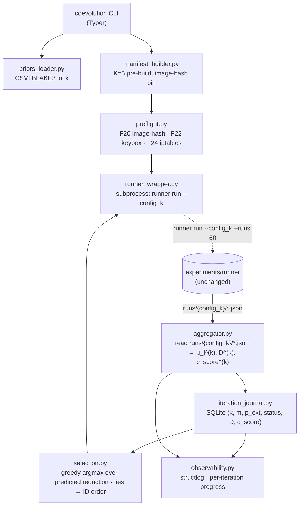

# experiments/coevolution — Specification

Status: DRAFT (Architecture)
Author: lead-software-architect subagent (Round-3 revision pass, Subagent C)
Date: 2026-05-14
Triggered by: 5/12 Round-3 reviewers (architecture-strategist, gap-analyst, lead-software-architect, code-simplicity-reviewer, code-reviewer/glm-replacement) — finding C8 in `plans/10-h6-adversarial-coevolution-addendum.md` §15.2 (forward reference without binding architectural contract); also addresses C9 (BLAKE3 schema collision) and S8 (atomic-split).
For: human review before any code is written; co-reviewed with the H6 addendum and `mitigation_priors.csv` in the 3-reviewer sanity round.
Constraints honored: F11 (resumable runs across iteration boundaries), F20 (image-hash pin per iteration), F21 (no privileged Docker — inherited from runner), F22 (keybox provenance — gates M03 mitigation), F23 (reproducibility split — coevolution journal is institutional-only), F24 (iptables-isolation pre-flight per iteration).

> Non-modification disclaimer: this SPEC does not edit `experiments/runner/SPEC.md`,
> `plans/00–04`, `registration/osf-preregistration.md`, or any frozen artifact. It lives only
> at `experiments/coevolution/SPEC.md`. The coevolution orchestrator is a **strict wrapper**
> over the runner CLI; no schema change to runner-side artifacts is proposed.

## 1. Scope and Non-Goals

### 1.1 In scope

1. The H6 K=4 adversarial co-evolution loop as specified in `plans/10-h6-adversarial-coevolution-addendum.md` §3.3.
2. A wrapper layer (`coevolution`) that orchestrates K+1=5 invocations of the existing `runner run` CLI with pre-built manifests `manifest_0.yml` … `manifest_4.yml`.
3. An iteration-state journal `iteration_journal.sqlite` maintained **side-by-side** with the runner's `runs/.journal.db` (NOT inside it; no foreign-key migration into runner-owned tables).
4. Pre-build and pin of 5 container image hashes (1 baseline + 4 mitigation-applied) before iteration k=0 begins (§7).
5. Per-iteration pre-flight checks for image-hash drift (F20), iptables-isolation (F24), and keybox-availability (F22).
6. Public/institutional artifact split (F23): aggregate D^(k) curve and irreducible-count are public; the per-iteration μ_i matrix, mitigation_history sequence, and priors-CSV row used per iteration are institutional-only.

### 1.2 Non-goals (explicit)

- **NOT** replacing or extending the runner. No edits to `experiments/runner/SPEC.md`.
- **NOT** modifying `run_id` derivation. The BLAKE3 material in runner/SPEC.md §6 lines 99–103 is **unchanged** (resolves Round-3 finding C9 by re-routing iteration provenance into manifest fields whose canonicalization already feeds the existing pre-image).
- **NOT** adaptive / online mitigation selection. m(k) is selected by the locked greedy rule against the locked priors CSV (`plans/10-...` §4.3, as revised by Subagent A).
- **NOT** live-platform contact, **NOT** privileged-Docker escalation, **NOT** any new dual-use uplift beyond what the baseline runner already implements.
- **NOT** distributed runs. Single ARM64 host, runner concurrency cap (default 4) unchanged.
- **NOT** statistical analysis. Trajectory test, BH-FDR, irreducible-count are computed by `experiments/analysis/` over the runner-emitted per-run JSON reports.

## 2. Relationship to `experiments/runner/SPEC.md`

The coevolution orchestrator is a **strict wrapper** over the runner CLI. Specifically:

| Concern | Owned by runner | Owned by coevolution |
|---|---|---|
| Container lifecycle, ADB, schema-validation, atomic-persistence | YES (runner/SPEC.md §3–§7) | NO |
| Run-ID derivation (BLAKE3 material) | YES (runner/SPEC.md §6 lines 99–103) | NO — UNCHANGED |
| Per-run JSON report → `runs/{config-id}/{run-id}.json` | YES (runner/SPEC.md §4 `persistence.py`) | NO |
| Per-run journal (runs/.journal.db) | YES (runner/SPEC.md §4 `resumability.py`) | NO |
| Iteration-state journal | NO | YES (`iteration_journal.sqlite`, §6) |
| K=5 manifest pre-build | NO | YES (§7) |
| Greedy m(k) / p_ext(k) selection vs priors-CSV | NO | YES (§4, §8) |
| Cross-iteration boundary control (atomic batch) | NO | YES (§4 atomicity rule) |

The orchestrator invokes:

```
runner run --config <config_id_k> --runs 60 [--resume]
```

K+1=5 times, with `config_id_k = "C8_full_coev_k{0..4}"` and one distinct pre-built manifest per k. Reads back the per-run JSON reports from `experiments/runs/{config_id_k}/` to compute μ_i^(k) per probe and feed the next iteration's selection rule.

Wrapper composition guarantees the runner remains a **pure I/O-bounded subprocess** with no awareness of "iteration" as a concept.

## 3. Architecture Diagram (Mermaid)



The dashed line is a `subprocess.run(["runner", "run", "--config", config_k, "--runs", "60"])` invocation. The runner is treated as an opaque executable.

## 4. Module Breakdown

| Module | Responsibility | LOC est. |
|---|---|---|
| `coevolution.py` | Typer entry point: `run`/`status`/`resume`/`verify`. No business logic. | 90 |
| `priors_loader.py` | Load `mitigation_priors.csv`, verify BLAKE3 against lock file. Refuse mismatch. | 70 |
| `manifest_builder.py` | Build K+1=5 `manifest_k.yml` files (extends runner manifest with metadata block, §4). Pin container_image_hash per iteration. | 140 |
| `selection.py` | Greedy m(k) and p_ext(k) selection per `plans/10-...` §4.3 / §5.3. Mechanical, no I/O. | 80 |
| `iteration_journal.py` | SQLite schema + atomic insert/transition + resumable lookup. See §6. | 130 |
| `preflight.py` | Per-iteration pre-flight: image-hash drift, iptables hash, keybox availability. Fail-loud. | 90 |
| `runner_wrapper.py` | `subprocess.run` wrapper: invoke runner CLI, capture exit-code, propagate logs. | 70 |
| `aggregator.py` | Read runner's per-run JSON reports for `config_id_k`; compute μ_i^(k), D^(k), c_score^(k). Re-uses `report_validator` schema. | 110 |
| `observability.py` | `structlog` JSON lines; per-iteration progress bar; trajectory line emission. | 60 |

Total estimate: **~840 LOC** (excluding tests and docstrings). Tests: ~250 LOC (pytest), bringing the engineering footprint to ~1,090 LOC — substantially smaller than the runner (~1,150 LOC) because no Docker/ADB/schema work is re-implemented.

## 5. Iteration Manifest Format (`manifest_k.yml`)

`manifest_k.yml` is a strict **extension** of the runner manifest schema (`experiments/runner/SPEC.md` §5 lines 78–93). Every runner-required key is present, unchanged. The extension adds a single `coevolution` metadata block:

```yaml
schema_version: "runner.v1"                       # UNCHANGED: runner schema v1
config_id: "C8_full_coev_k2"                      # k embedded in config_id (NOT a new schema key)
created: "2026-06-15T00:00:00Z"
container_image_hash: "sha256:..."                # PER-ITERATION pin (§7)
compose_file: "stack/coev/k2/docker-compose.yml"
seccomp_profile: "stack/redroid-seccomp.json"
detector_lab_apk: "experiments/apk/detectorlab-0.2.0.apk"  # extended w/ p_ext(0..k)
detector_lab_apk_hash: "sha256:..."
target_runs: 60                                   # N, matches H6 §6.1
warmup_seconds: 30
probe_timeout_seconds: 240
binder_device: "/dev/binder"
seed: "0x9c3a..."
modules: { ... }                                  # informational; not used by runner
coevolution:                                      # NEW metadata block (informational, NOT used by runner)
  iteration_k: 2
  parent_image_hash: "sha256:..."                 # k-1 image hash (k=0 has parent = baseline C8_full image)
  mitigation_history_hash: "blake3:..."           # BLAKE3 of sorted_join(m(1)..m(k))
  probe_extension_history_hash: "blake3:..."      # BLAKE3 of sorted_join(p_ext(1)..p_ext(k))
  priors_csv_hash: "blake3:..."                   # BLAKE3 of locked mitigation_priors.csv
  selected_mitigation: "M04"                      # m(k) per §4.3 of the H6 addendum
  selected_probe_extension: "#79"                 # p_ext(k) per §5.3 of the H6 addendum
```

**Critical property:** runner's `config_loader.py` (runner/SPEC.md §4) refuses unknown keys. The `coevolution` block is therefore **stripped** before the manifest is passed to the runner. The orchestrator keeps the un-stripped version in `iteration_journal.sqlite` for provenance; the runner receives the stripped variant. This is the binding contract that makes the wrapper non-invasive: runner sees only what it already understands.

Implementation note: `manifest_builder.py` emits two files per iteration:
- `experiments/coevolution/manifests/manifest_k.yml` (full, with `coevolution` block) — institutional-only artifact.
- `experiments/coevolution/manifests/manifest_k.runner.yml` (stripped) — handed to runner CLI.

The full manifest's BLAKE3 is included in the iteration_journal row for tamper-evidence.

## 6. Run-ID Derivation (Reconciliation with `runner/SPEC.md` §6)

Runner's BLAKE3 pre-image (`runner/SPEC.md` lines 99–103) is:

```
canonical = canonical_json(manifest_minus_modules)
material  = canonical ‖ apk_sha256 ‖ uint32_be(run_index) ‖ schema_version
run_id    = base32(BLAKE3(material))[:16].lower()
```

Coevolution does **not** alter this pre-image. Instead, namespace-disjointness across iterations is achieved structurally via the runner-visible manifest fields:

| Iteration | `config_id` | `container_image_hash` | `detector_lab_apk_hash` | Resulting run-ID namespace |
|---|---|---|---|---|
| k=0 | `C8_full_coev_k0` | hash(image-baseline-C8_full) | hash(apk-baseline) | **intentionally collides** with C8_full baseline run-IDs (see §6.1) |
| k=1 | `C8_full_coev_k1` | hash(image-k1-with-m(1)) | hash(apk-with-p_ext(1)) | disjoint |
| k=2 | `C8_full_coev_k2` | hash(image-k2-with-m(1..2)) | hash(apk-with-p_ext(1..2)) | disjoint |
| k=3 | `C8_full_coev_k3` | hash(image-k3-with-m(1..3)) | hash(apk-with-p_ext(1..3)) | disjoint |
| k=4 | `C8_full_coev_k4` | hash(image-k4-with-m(1..4)) | hash(apk-with-p_ext(1..4)) | disjoint |

Because every k>0 manifest carries a distinct `container_image_hash` AND a distinct `detector_lab_apk_hash`, the canonical_json differs in two independent fields → run-ID collision probability across iterations is bounded by the BLAKE3-256 truncated-to-80-bit collision floor of the runner (already analyzed in runner/SPEC.md §6).

### 6.1 Intentional k=0 collision (reuse claim preserved)

By construction, `manifest_0.yml` reduces to the C8_full baseline manifest **byte-for-byte** (same image hash, same APK hash, same seed, same `config_id` if the operator chooses to alias). This means run-IDs at k=0 are identical to the C8_full baseline run-IDs. The H6 addendum's §6.1 reuse claim ("k=0 data coincides with C8_full, marginal cost = 4 × 60 = 240 runs") is therefore preserved.

To realize the alias, `manifest_builder.py` accepts a flag `--reuse-c8-baseline` that sets `config_id = "C8_full"` for k=0 instead of `"C8_full_coev_k0"`. Default is OFF (no alias) for clarity; ON is used only when the human operator explicitly opts into reuse.

### 6.2 Verification

`coevolution verify` (§8) re-derives every run-ID from the recorded manifests and asserts equality with the runner's journal — independent reproducibility check.

## 7. Pre-Build Discipline (F20 strict mode)

All K+1=5 container images and APK artifacts are built **once** before iteration k=0 begins. Mid-loop rebuilds are FORBIDDEN.

| Artifact | Built by | Pinned in | When |
|---|---|---|---|
| `image-baseline-C8_full` | `stack/coev/k0/build.sh` | `manifest_0.yml.container_image_hash` | before k=0 |
| `image-k1` … `image-k4` | `stack/coev/k{1..4}/build.sh` | `manifest_{1..4}.yml.container_image_hash` | before k=0 |
| `detectorlab-coev-k{0..4}.apk` | DetectorLab CI | `manifest_k.yml.detector_lab_apk_hash` | before k=0 |

Pre-build invariants enforced by `coevolution verify`:

1. All 5 image hashes resolve under local Docker (`docker image inspect`), `--pull=never` policy active.
2. All 5 APK hashes resolve under `experiments/apk/`.
3. The locked `mitigation_priors.csv` BLAKE3 matches `experiments/coevolution/.priors.lock`.
4. The selection rule, applied dry-run against the locked priors, yields the same (m(1), m(2), m(3), m(4)) sequence that was used to schedule the image builds.

**Drift handling:** if any of the four invariants fails after k=0 begins, the orchestrator halts at the iteration boundary, writes `status=ABORTED_DRIFT` in `iteration_journal`, and exits with the runner-compatible exit-code 78. Mid-loop image rebuilds are NEVER auto-triggered.

**Re-baselining:** if `mitigation_priors.csv` is amended post-Round-3 sign-off (Open Question 7 of `plans/10-...` §12), all 5 images are re-built with new hashes, the iteration_journal is archived under `experiments/coevolution/runs.archive/{timestamp}/`, and the loop restarts from k=0. This is a manual operator workflow gated by an OSF amendment timestamp (per addendum §15.7 category 3).

## 8. Iteration Journal Schema (`iteration_journal.sqlite`)

Located at `experiments/coevolution/iteration_journal.sqlite`. **Separate file** from runner's `runs/.journal.db` — no foreign-key constraint crosses files. Cross-reference is by `run_id` value, not by SQL FK.

```sql
CREATE TABLE iteration_state (
  iteration_k         INTEGER PRIMARY KEY,             -- 0..4
  config_id           TEXT    NOT NULL,                 -- e.g. "C8_full_coev_k2"
  mitigation_id       TEXT,                             -- m(k) ∈ M ∪ {NULL at k=0}
  probe_extension_id  TEXT,                             -- p_ext(k) ∈ P_ext ∪ {NULL at k=0}
  manifest_blake3     TEXT    NOT NULL,                 -- BLAKE3 of full manifest_k.yml
  parent_image_hash   TEXT    NOT NULL,                 -- image hash of k-1 (or baseline at k=0)
  container_image_hash TEXT   NOT NULL,                 -- pinned per §7
  status              TEXT    NOT NULL,                 -- PENDING|PREFLIGHT|RUNNING|AGGREGATING|COMPLETED|ABORTED_DRIFT|HALTED_F22|HALTED_F24|HALTED_OOM
  started_at          TEXT,
  finished_at         TEXT,
  runs_completed      INTEGER NOT NULL DEFAULT 0,       -- 0..60
  runs_failed         INTEGER NOT NULL DEFAULT 0,
  mean_D              REAL,                             -- aggregate detection-rate D^(k)
  irreducible_count   INTEGER,                          -- Σ_i 1[μ_i^(k) > 0.20]
  c_score             REAL                              -- coherence at iteration k
);

CREATE TABLE iteration_runs (
  iteration_k         INTEGER NOT NULL REFERENCES iteration_state(iteration_k),
  run_id              TEXT    NOT NULL,                 -- value matches runner's runs.run_id
  PRIMARY KEY (iteration_k, run_id)
);

CREATE TABLE iteration_audit (
  ts                  TEXT    NOT NULL,
  iteration_k         INTEGER,
  event               TEXT    NOT NULL,                 -- e.g. PREFLIGHT_OK, IMAGE_HASH_MISMATCH
  detail              TEXT
);
```

**Atomicity invariant:** iteration k is `COMPLETED` only when `runs_completed == target_runs (60)` AND aggregator has written `mean_D`, `irreducible_count`, `c_score`. Iteration k+1 cannot enter `PENDING` until k is `COMPLETED`. There is no partial-iteration carry-over.

**Resumability (F11):** on restart, `coevolution resume` reads the highest `iteration_k` with `status IN (PENDING, PREFLIGHT, RUNNING, AGGREGATING)` and re-enters at that iteration. The runner's own `--resume` flag handles per-run resumability within iteration k. There is no "collapse" of partial k into k+1.

## 9. Pre-Flight Checks (per iteration, fail-loud)

Before each invocation of `runner run --config_k --runs 60`:

| Check | Source | Failure → status |
|---|---|---|
| `docker image inspect <pinned hash>` exists locally and matches | F20 | ABORTED_DRIFT |
| iptables-isolation state hash equals k-1's hash | F24 | HALTED_F24 |
| Keybox availability ≥ M03 quorum (if m(k)==M03) | F22 | HALTED_F22 |
| `mitigation_priors.csv` BLAKE3 matches `.priors.lock` | Round-3 finding C2 | ABORTED_DRIFT |
| Disk free ≥ 50 GB at `runs/` mountpoint | host hygiene | HALTED_OOM |

Pre-flight is **synchronous** and **idempotent**. Re-running pre-flight after a halt is safe.

## 10. CLI Interface

```
coevolution run    --priors-csv experiments/coevolution/mitigation_priors.csv \
                   --priors-lock experiments/coevolution/.priors.lock \
                   --manifests-dir experiments/coevolution/manifests/ \
                   --output-dir experiments/coevolution/runs/ \
                   --max-iterations 4 \
                   [--resume] [--dry-run]

coevolution status                  # tabular per-iteration state from iteration_journal
coevolution resume                  # restart from highest unfinished iteration
coevolution verify                  # check 5 image-hash pins, priors-CSV BLAKE3, manifest BLAKE3 chain
coevolution journal --iteration k   # show iteration_runs and audit log
coevolution prebuild --plan         # print the build plan derived from priors CSV; no side effects
```

Exit codes (aligned with runner/SPEC.md §8): 0 success · 64 bad-CLI · 65 manifest-invalid · 66 priors-csv-mismatch · 67 image-hash-drift · 68 iptables-drift · 69 keybox-unavailable · 78 policy-refused · 70 internal.

## 11. Failure Modes & Recovery

| Failure | Detection | Action |
|---|---|---|
| Image-hash drift between pre-build and iteration k | `preflight.py` | iteration k → ABORTED_DRIFT; halt loop; require operator re-verification |
| iptables-isolation hash drift mid-loop (F24) | `preflight.py` pre-iteration | iteration k → HALTED_F24; halt loop |
| Keybox revocation mid-loop (F22) while m(k)==M03 | `preflight.py` | iteration k → HALTED_F22; loop pauses; no silent fallback keybox |
| SpoofStack module conflict mid-iteration (e.g. M07⊕M02 incompatibility per `plans/02-spoofstack.md` Konflikt-Vermeidung) | runner reports BOOT_FAIL or PROBE_TIMEOUT on > 50% of N=60 runs | iteration k → ABORTED_DRIFT with incident log; do NOT retry with different mitigation; escalate to human |
| Host OOM mid-iteration k | iteration_journal shows `runs_completed < 60` and `status=RUNNING` after restart | `coevolution resume` re-enters k; runner's `--resume` finishes remaining runs in k; never collapse partial k into k+1 |
| `mitigation_priors.csv` BLAKE3 mismatch | `priors_loader.py` startup check | exit 66; refuse to start |
| Manifest BLAKE3 mismatch (someone edited manifest after pre-build) | `coevolution verify` | refuse to start; require re-baseline |
| Runner subprocess crashes (signal, segfault) | `runner_wrapper.py` exit-code != 0 | iteration k → HALTED; preserve partial runs; surface runner stderr |
| Privileged-Docker introduced into compose mid-loop | runner's own F21 pre-check (runner/SPEC.md §7) | runner exits 78; iteration k → ABORTED_DRIFT |

**Atomicity at iteration boundaries (locked):** all N=60 runs at iteration k MUST `status=COMPLETED` in the runner journal AND the aggregator MUST have produced (μ_i^(k), D^(k), c_score^(k)) BEFORE `selection.py` is asked to compute m(k+1) and p_ext(k+1). The selection function is pure (CSV in + per-iteration μ in → m, p_ext out) and is the only cross-iteration data dependency. There is no streaming / pipelined cross-iteration execution.

## 12. Observability

### 12.1 Public artifacts (per F23)

- Aggregate trajectory `D^(0..K)` as CSV: `experiments/coevolution/runs/aggregate-trajectory.csv` (columns: `iteration_k, D, c_score, irreducible_count`).
- Irreducible-probe count at convergence as a scalar in the same CSV.
- Trajectory plot (PNG) generated by `experiments/analysis/` from the above CSV.

### 12.2 Institutional-only artifacts (per F23 + Round-3 finding C6 of `plans/10-...` §15)

- Per-iteration per-probe means `μ_i^(k)` matrix (75 × 5 floats).
- `mitigation_history`: the sequence `m(1), m(2), m(3), m(4)`.
- `probe_extension_history`: the sequence `p_ext(1), p_ext(2), p_ext(3), p_ext(4)`.
- The locked `mitigation_priors.csv` row selected at each iteration.
- Full `manifest_k.yml` (with `coevolution` block) for k ∈ {0..4}.
- `iteration_journal.sqlite` itself.

These artifacts live under `experiments/coevolution/institutional/` and are excluded from the public reproducibility-pack per `plans/04-deliverables.md` D3 (as amended by F23).

### 12.3 Logs and metrics

- `structlog` JSON lines → `experiments/coevolution/.logs/{date}.ndjson`.
- Prometheus textfile additions (alongside runner's, see runner/SPEC.md §11):
  - `coevolution_iterations_total{status}`
  - `coevolution_iteration_duration_seconds_bucket`
  - `coevolution_preflight_failures_total{check}`
- Live progress: `rich` progress bar per iteration, suppressible with `--no-tty`.

## 13. F-Correctives Honored

| Finding | How honored |
|---|---|
| F11 (resumable runs across OOM) | iteration_journal atomicity; runner's own `--resume` handles per-run; coevolution `resume` re-enters at unfinished iteration; partial iterations are never collapsed forward |
| F20 (image-hash pin) | 5 manifests, each with pinned `container_image_hash`; `--pull=never`; mid-loop rebuild FORBIDDEN; ABORTED_DRIFT on mismatch |
| F21 (no privileged Docker) | inherited transitively from runner's pre-check; wrapper adds NO privileged escalation; verified by `coevolution verify` invoking `runner verify` |
| F22 (keybox provenance) | M03 mitigation gated on per-iteration keybox-availability check; revocation → HALTED_F22; no silent fallback |
| F23 (reproducibility-pack split) | priors-CSV, μ_i matrix, mitigation_history, iteration_journal classified institutional-only (§12.2); public artifacts limited to aggregate D^(k) and irreducible-count (§12.1) |
| F24 (iptables isolation) | per-iteration pre-flight verifies iptables state hash equals k-1's; HALTED_F24 on drift |

## 14. Test Strategy

Unit (no Docker, no runner subprocess):
- `priors_loader` BLAKE3-verify happy/fail (10 fixtures).
- `selection.greedy_argmax` correctness against hand-computed cases (8 priors × 4 iterations; argument is **predicted reduction** per priors-CSV, larger is better — consistent with addendum §4.3 post-S2 fix).
- `manifest_builder` emits stripped vs full manifest pair; runner-schema validation of stripped variant passes.
- `iteration_journal` atomicity: cannot transition k+1 to PENDING while k is not COMPLETED.
- `preflight` rejects iptables-hash mismatch.

Integration (mocked runner CLI):
- `coevolution run` against a `runner-mock` subprocess that emits canned per-run JSONs for k=0..4.
- Tests: `--resume` after SIGKILL mid-iteration; never collapses partial k.
- Tests: image-hash drift detection → ABORTED_DRIFT; verify exit code 67.

End-to-end (gated, post-legal):
- 1 dry-run iteration on real ReDroid behind `RUN_E2E=1`. Never wired to CI.

## 15. Language Choice and Estimated Effort

Python 3.12, same as runner/SPEC.md §14. Re-uses `pandas` (priors CSV), `pyyaml` (manifests), `blake3` (hashing), `structlog` (logs), `python-on-whales` (image-hash inspect — same dep as runner).

| Item | Days |
|---|---|
| Module implementation (~840 LOC) | 3 |
| iteration_journal schema + tests | 0.5 |
| Mock-runner integration harness | 1 |
| Resumability across iteration boundaries (crash tests) | 0.5 |
| Observability + Prom textfile additions | 0.5 |
| Documentation + runbook | 0.5 |
| Code review + adversarial round | 1 |
| **Total** | **~7 person-days** |

This is **on top of** the runner's ~11 person-days. Combined `experiments/` engineering footprint: **~18 person-days**. The Gantt impact is acknowledged in `plans/10-...` §15 finding S9 (20h marginal orchestrator runtime + 7 person-days marginal engineering = total Phase 4 ≈ 147h orchestrator wall-clock and ≈ 18 person-days engineering).

## 16. Implementation Gate

Implementation MUST NOT begin until **all** of the following are cleared in writing:

1. F21 (privileged Docker) — cleared by university legal/IT-Sec; gates runner first, gates coevolution by inheritance.
2. F22 (keybox provenance) — at least 1 keybox cleared by Rechtsabteilung before M03 can be exercised (graceful degradation per `plans/10-...` §9 to `|M_active|=7` if 0 cleared).
3. F23 (reproducibility split) — public/institutional split confirmed for `plans/04-deliverables.md` D3.
4. `mitigation_priors.csv` (Subagent B's deliverable) is locked, reviewed, and `.priors.lock` BLAKE3 committed.
5. Runner implementation is complete and `runner verify` passes against the 5 pre-built images.
6. OSF amendment 3 (H6 hypothesis + RDFs 8–13) is timestamped per `plans/10-...` §11.

## 17. Open Questions for Human Partner

1. ~~Should `iteration_journal.sqlite` ever be merged with runner's `runs/.journal.db` for unified observability?~~ **RESOLVED (F-H6-rev-001) as binding NON-GOAL:** `iteration_journal.sqlite` is **NEVER** merged with `runs/.journal.db`. This is a binding architectural non-goal (consistent with §1.2). Cross-reference is by `run_id` value only (SQL VALUE join in `experiments/analysis/`, not FK). Rationale: (a) strict-wrapper claim requires the runner to remain unaware of "iteration" as a concept; (b) runner-side migrations would have to consider coevolution if journals were merged, breaking the C8 wrapper boundary; (c) F23 institutional-vs-public split is cleaner when the institutional-only iteration_journal is a physically separate file.
2. How are priors-CSV updates post-lock handled — zero-tolerance halt-and-restart-from-k=0, OR amendment-with-OSF-timestamp-restart? §7 currently specifies the latter. Confirm.
3. ~~Should `--reuse-c8-baseline` (§6.1) default to ON to maximize reuse, or OFF for explicit auditability?~~ **RESOLVED (F-H6-rev-002):** Default remains OFF for explicit auditability. The 240-run marginal-cost claim in addendum §6.1 is realized ONLY when the operator passes `--reuse-c8-baseline` explicitly. Without the flag, total = 300 fresh runs and Gantt budget = 25h marginal (not 20h). Documented in addendum §6.1.
4. Is a 5th per-iteration pre-flight check needed for DetectorLab APK build provenance (currently only hash-pinned, not source-rebuilt)? Defer to DetectorLab CI policy.
5. Resumability semantics across re-baselining (§7): should the archived iteration_journal be readable by `coevolution status --archive`, or only by direct SQLite inspection?

## 18. Cross-References

- `experiments/runner/SPEC.md` — the wrapped runner (this SPEC defers to lines 78–93 §5 manifest schema, lines 99–103 §6 run-ID derivation, §7 failure-modes, §11 observability).
- `plans/10-h6-adversarial-coevolution-addendum.md` — the methodological contract (this SPEC implements §3.3, §4 mitigation-set, §5 probe-extension-set, §6 statistics, §7 K=4 lock).
- `experiments/coevolution/mitigation_priors.csv` — the locked prior matrix consumed by `priors_loader.py`; lock file at `experiments/coevolution/.priors.lock`.
- `registration/osf-preregistration.md` §9 (after Amendment 3) — the pre-registration anchor; this SPEC is design-only and cannot be implemented until Amendment 3 is timestamped.
- `plans/02-spoofstack.md` Konflikt-Vermeidung — informs §11 SpoofStack-conflict handling.
- `plans/05-validation-feedback.md` F11/F20/F21/F22/F23/F24 — the binding findings table.

---

**Approved to begin implementation post-F21/F22/F23-clearance, post-priors-CSV-lock, post-runner-implementation, post-OSF-Amendment-3? Y / N**
